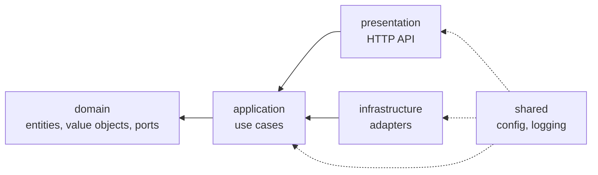

# Architecture

This document explains how MediaHub is put together and, more importantly,
*why*. It is written for the person who joins in year three and has to change
something without breaking everything.

If you only remember one thing: **dependencies point inward, always.**

> **Scope note.** This document describes the Foundation phase (the code that
> exists today). The complete system design — bounded contexts, pipeline, queue,
> workers, storage custody, security, plugins and the target folder structure —
> is specified in **[docs/architecture/](docs/architecture/)** and takes
> precedence where the two disagree. In particular, Phase 02 replaces
> PostgreSQL with SQLite, replaces the permanent-storage model with ephemeral
> custody, and splits the worker into its own process; see
> [20. Architecture Decision Review](docs/architecture/20-architecture-decision-review.md).

---

## 1. Goals

1. **Business rules outlive frameworks.** FastAPI, SQLAlchemy and Postgres are
   details. They will be replaced eventually; the rules about what a media item
   is must survive that.
2. **Every rule has exactly one home.** "At most one active job per item" is
   stated in the domain and enforced by a database index - not scattered across
   three route handlers.
3. **The whole system is testable without infrastructure.** 300+ tests run in
   under two seconds with no database, no network and no Docker.
4. **Boundaries are enforced, not requested.** A layering rule that lives only
   in a document is a rule that will be broken in a hurry, on a Friday.

### Non-goals

- Micro-optimisation before measurement.
- Abstraction for its own sake. There is no repository interface for something
  with a single possible implementation and no test seam.
- Hiding the framework everywhere. FastAPI is used fully and idiomatically -
  inside the presentation layer, where it belongs.

---

## 2. The dependency rule



Source code dependencies only ever point toward the domain. Control flow runs
the other way - an HTTP request drives a use case, which drives an adapter -
and dependency inversion is what lets those two directions disagree: the
*interface* belongs to the inner layer, the *implementation* to the outer one.

| Layer            | May import                                                     |
| ---------------- | -------------------------------------------------------------- |
| `domain`         | `domain` only. No third-party packages at all.                 |
| `application`    | `domain`, `application`, `shared`, plus Loguru                 |
| `infrastructure` | everything except `presentation`                               |
| `presentation`   | everything, but `infrastructure` only in the composition root  |
| `shared`         | `shared` only - it may not import any layer                    |

`tests/architecture/test_layer_dependencies.py` parses every module and fails
CI with the exact file and import that broke a rule. It also asserts that every
module has a docstring.

---

## 3. The layers

### 3.1 Domain - what the business is

Pure Python. No framework, no I/O, no configuration, no clock.

**Value objects** (`SourceUrl`, `MediaTitle`, `StorageKey`, `FileSize`,
`Checksum`, `DownloadProgress`, `RetryPolicy`) are frozen dataclasses that
validate on construction. This is the single highest-leverage decision in the
codebase: because an invalid `SourceUrl` cannot exist in memory, no entity, use
case or adapter contains defensive input checking. Validation happens once, at
the boundary of the type.

**Aggregates** (`MediaItem`, `DownloadJob`) are state machines. Every mutation
is a named intention (`mark_available`, `cancel`, `requeue`), never attribute
assignment. Each one validates the transition against an explicit
`ALLOWED_TRANSITIONS` table, stamps `updated_at`, and records a domain event.
Illegal transitions raise; they cannot silently corrupt state.

**Time is an argument, never a global.** Aggregates receive `now` from the
caller, so their behaviour is deterministic and tests need no patching.

**Repository ports** are declared here as `Protocol`s and implemented in
`infrastructure`. This is the dependency inversion that keeps the core free of
SQLAlchemy.

### 3.2 Application - what the system does

One class per use case, one public `execute` method. A use case:

1. converts primitives into value objects (so bad input fails as a domain
   error with a proper code),
2. opens exactly one unit of work,
3. orchestrates aggregates,
4. commits,
5. publishes the events the aggregates recorded,
6. returns a DTO.

It contains no business rules of its own and no I/O details. Anything ambient
it needs - the clock, id generation, event publishing, the download engine - is
a port declared here and satisfied by an adapter at wiring time.

**DTOs, not entities, cross the boundary.** Handing a `MediaItem` to a route
would let the route invoke domain behaviour outside a transaction.

### 3.3 Infrastructure - how it talks to the world

Adapters, one per port. Two persistence implementations - SQLAlchemy/Postgres
and in-memory - both satisfying the same protocols, which is what makes the
test suite fast and honest at the same time.

**ORM models are not domain entities.** Translation is explicit, in
`persistence/sqlalchemy/mappers.py`. Mapping the ORM directly onto aggregates
is quicker to write and expensive forever: entities grow nullable columns to
satisfy the mapper, lazy loading fires queries from inside domain logic, and
every schema migration becomes a domain change. A few dozen lines of mapper
keeps the schema and the model free to evolve apart.

**The composition root** (`infrastructure/di/container.py`) is the only place
that knows which adapter satisfies which port. No service locator, no
auto-discovery, no module-level singleton - just a readable function. Each
container field is annotated with its *port*, so mypy proves at build time that
the adapter conforms.

### 3.4 Presentation - how it is driven

Parse, translate, await, serialise. That is the whole job. Routes never catch
domain errors: handlers registered in `presentation/api/errors.py` map error
*categories* to status codes, so a new `ConflictError` subclass answers `409`
without anyone updating a table.

`create_app` is a factory, not a module-level `app`. A global application is
built at import time, which makes configuration untestable, prevents two apps
from coexisting in one process, and drags a database connection into every
import.

### 3.5 Shared - the two genuine cross-cuts

Configuration and logging, and nothing else. Both are imported freely by every
layer, which is exactly why `shared` is forbidden from importing any layer.

---

## 4. Key patterns

### Unit of work

One use case, one transaction. Repositories are reached *through* the unit of
work rather than injected individually, which guarantees they share a session:

```python
async with self._unit_of_work() as uow:
    item = await uow.media.get(media_id)
    ...
    await uow.commit()
```

Leaving the block without committing rolls back. A use case that raises halfway
changes nothing. The in-memory implementation provides the same guarantee via
snapshot isolation, so tests exercise real transactional semantics.

### Domain events

Aggregates record facts; the application drains and publishes them **after**
the commit, because an event must only ever describe something durable. Today
the publisher writes structured log lines. When a broker is introduced, the
adapter changes and nothing else does - though at-least-once delivery will want
a transactional outbox rather than a fallible publish.

### The acquisition pipeline

A job is executed as five checkpointed stages - probe, download, verify, deliver,
cleanup - by handlers in `presentation/worker/stages/`. The order lives in one
place, `DEFAULT_STAGE_PLAN`, and is executed in one place, `StageExecutor`.

Each handler is three lines, because the work is one `ensure_*` method per stage
in `stages/acquisition.py`, and each method **ensures** its outcome rather than
performing it: already done, it returns; missing its inputs, it rebuilds them.
Two properties fall out of that shape, and both are load-bearing.

*Re-running a stage is free.* A job reclaimed mid-stage runs that stage again -
the runtime requires handlers to tolerate it - and a step that has happened costs
a lookup.

*A checkpoint is resumable from anywhere.* The workspace lease belongs to **one
attempt**, so a job that resumes past `download` opens a new, empty lease. The
artifact is recorded together with the lease it was written into, so `verify`
sees "the bytes are gone" rather than "the bytes are stale", and fetches them
again. Without that, the most ordinary crash in the system - a power cut between
downloading and delivering - would deliver nothing at all.

What crosses between stages is a single JSON `PipelineState` in the checkpoint's
resume token. That is deliberate: the write recording a stage as complete and the
write recording what it produced are the *same* write, so no reader can ever see
one without the other. Once the delivery receipt is in it, the transfer is never
repeated, and only then may anything local be deleted.

### Error handling

| Category                      | HTTP  |
| ----------------------------- | ----- |
| `EntityNotFoundError`         | `404` |
| `ConflictError`, transitions  | `409` |
| `InvariantViolationError`     | `422` |
| `FeatureNotAvailableError`    | `501` |
| `PermissionDeniedError`       | `403` |
| anything else                 | `500` |

Every error carries a stable `code`. Clients branch on the code; `detail` is
prose and may change. Unhandled exceptions are logged in full and answered with
a generic body - an error response is an excellent place to leak file paths and
queries.

### Observability

One structured line per request, one correlation id per request. The id is
taken from an inbound `X-Request-ID` or generated, stored in a `ContextVar`
(which asyncio propagates into child tasks), injected into every log record by
a Loguru patcher, and echoed on the response. No call site ever passes it
explicitly. Standard-library logging - uvicorn, SQLAlchemy, Alembic - is
intercepted into the same sink.

---

## 5. Persistence and migrations

- Enums are stored as short strings, not native Postgres enums: adding a value
  to a `VARCHAR` needs no migration and no lock. The domain is the authority on
  which values are legal.
- `priority_weight` denormalises `JobPriority` so the scheduler can order by an
  indexed integer.
- A **partial unique index** enforces "at most one queued/running job per media
  item" in the database. Invariants that protect data integrity must not depend
  on the application winning a race.
- Index and constraint names come from a fixed naming convention. Without it,
  Postgres invents names and Alembic autogenerate cannot reliably diff them -
  and changing the convention later means renaming every existing constraint.
- Migrations read the database URL from `Settings`, never from `alembic.ini`.

See [migrations/README.md](migrations/README.md) for the working rules.

---

## 6. API versioning

Every business route lives under `/api/v1`. Health probes stay unversioned
because orchestrators hard-code their paths.

Once `v1` ships its schemas are additive-only. A breaking change means a `v2`
package beside `v1`, with both served until clients migrate. Copying a schema is
cheap; breaking a running client is not.

---

## 7. Testing strategy

| Suite          | What it proves                                              |
| -------------- | ----------------------------------------------------------- |
| `unit`         | Domain rules, use case orchestration, adapter semantics      |
| `integration`  | The HTTP surface end to end, including the error contract    |
| `architecture` | The dependency rule and the documentation requirement        |

Test doubles (`FrozenClock`, `SequentialUuidGenerator`,
`RecordingEventPublisher`) implement the same protocols as production adapters,
so mypy checks them identically. Time is frozen and ids are sequential, which
makes assertions exact rather than approximate.

The suite needs no infrastructure. That is not a shortcut - it is the return on
the ports-and-adapters investment.

---

## 8. What is deliberately not here

**Download execution.** `DownloaderPort` defines the contract; `NullDownloader`
declines every request with a typed error. Everything around the seam -
persistence, state machine, API, events, tests - is complete, so adding an
engine is additive. See the README for the three steps.

**A scheduler.** The worker recovers lapsed leases at startup and the container
sweeps the workspace root at startup, which is enough for a single-worker
deployment; running those *periodically* - the lease reaper, the expiry sweep,
the workspace sweep on a timer - belongs to a scheduler process
([19](docs/architecture/19-folder-structure.md) §19.6) and is not built yet. The
decision each sweep makes already exists and is tested
(`RecoveryPolicy`, `RecoverWorkspaces`); what is missing is the clock that
drives it.

**A lease table.** Workspace leases are recorded as a manifest inside each lease
directory, which is what makes ownership decidable after a crash. The database
row that would let two *processes* share one workspace root safely
([11](docs/architecture/11-storage-strategy.md) §11.6) is not built; until it
is, reservation accounting is per process and a shared root relies on the
conservative half of the recovery policy - never delete another identity's lease
until it has been quiet for a full lease period.

**A per-job destination.** The acquisition pipeline is wired (§4); what a
queued `DownloadJob` still does not carry is *where the result should go*. The
worker therefore delivers to the deployment's configured default destination,
and per-request destinations come from the interface that knows them - the
Telegram gateway calls `AcquireMedia` directly with the chat it was messaged
from. Giving the job its own destinations is the Delivery aggregate of
[06](docs/architecture/06-domain-model.md) §6.4, and is a schema change rather
than a wiring one.

**A SQL job queue.** `JobQueue` (`application/download/queue.py`) has one
adapter today, over the in-memory store. The SQLite implementation is a single
conditional `UPDATE ... RETURNING`
([09](docs/architecture/09-queue-architecture.md) §9.4) and must pass the same
contract suite (`tests/contract/test_job_queue_contract.py`).

**Authentication.** `PermissionDeniedError` exists and maps to `403`; nothing
raises it yet.

Each of these is a seam that was designed now and implemented later, on
purpose. That is different from a gap.

---

## 9. How to extend

**A new use case:** add a command/query and a DTO in the feature's `dto.py`,
add a class with `execute` under `use_cases/`, expose it from the container,
add a provider in `dependencies.py`, and add a route. Nothing else changes.

**A new adapter:** implement the port, swap it in `build_container`. If you find
yourself editing a use case to make an adapter fit, the port is leaking
implementation detail and should be redesigned.

**A new aggregate:** create a package under `domain/`, with entities, value
objects, events, errors and a repository port; implement the port twice (SQL and
in-memory); add the migration; then build use cases on top.

**A new delivery mechanism** (CLI, bot, message consumer): a sibling package
under `presentation/` that calls the same use cases. It needs no changes
anywhere else - which is the whole point of the arrangement.
