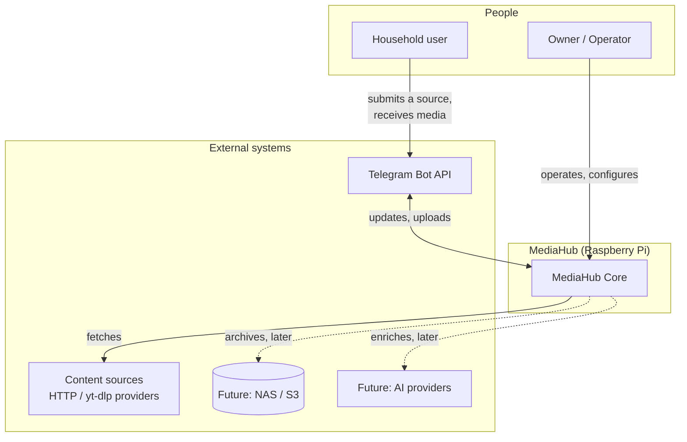
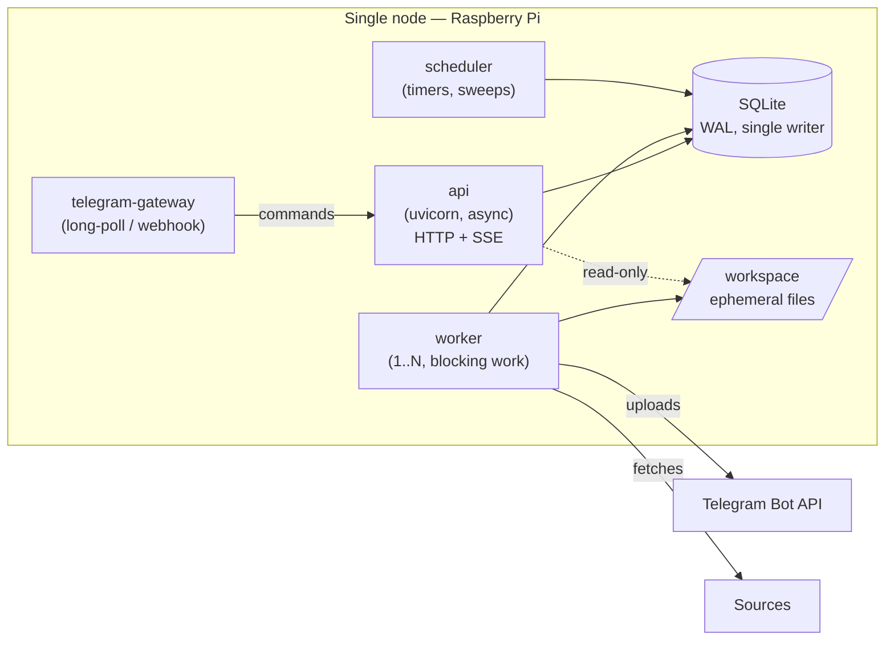
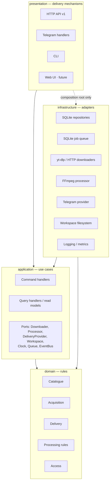

# 01. Overall Product Architecture

## 1.1 What MediaHub is

MediaHub is a **personal media acquisition and delivery platform** that runs on
hardware you own. A person submits a source (a URL today; a subscription or a
schedule later), MediaHub acquires it, makes it deliverable, hands it to one or
more destinations, and then **forgets the bytes while remembering everything
else**.

The product is the pipeline and the catalogue. Telegram is a destination.
The HTTP API is an entry point. Both are replaceable.

### What it is not

- Not a media *server* (no streaming, no library on disk, no transcoding farm).
- Not a Telegram bot with extra steps. Telegram code must be deletable.
- Not multi-tenant SaaS. Single household, a handful of principals, one node.

---

## 1.2 System context

The user's primary interface today is Telegram, but the arrow that matters is
`Core → TG`: Telegram is something the Core *calls through a port*, never
something it is built around.

---

## 1.3 Container view (processes)

**Four process roles, one image.** They differ only by entrypoint, so there is
one dependency set, one build, one version.

| Process | Role | Why separate |
| ------- | ---- | ------------ |
| `api` | HTTP surface, reads, command intake, SSE progress | Must stay responsive; must never block |
| `telegram-gateway` | Translates Telegram updates into commands | Isolates a chatty, rate-limited, third-party protocol; can crash and restart without touching the API |
| `worker` | Executes jobs: download, process, deliver | Runs blocking subprocesses (yt-dlp, FFmpeg) that would stall an event loop; needs independent restart and resource limits |
| `scheduler` | Time-driven work: retries becoming due, lease reclaim, cleanup sweeps, subscriptions | One clock owner avoids duplicated timers across workers |

**Phase 01 defect:** the current design runs everything in the API process.
A single FFmpeg call would freeze every request. See
[20](20-architecture-decision-review.md) §4.10.

Gateway and scheduler may be collapsed into the API process behind a feature
flag on a 2 GB Pi. The worker may not — that separation is structural.

---

## 1.4 Component view (inside the image)

Arrows are **source-code dependencies**. Control flows the other way: HTTP
drives a use case, which drives an adapter through a port. The full rule set,
including the cross-context axis, is in [04](04-dependency-graph.md).

---

## 1.5 Subsystem responsibilities

| Subsystem | Owns | Never does |
| --------- | ---- | ---------- |
| **Core** | Catalogue identity, dedup, custody rules | Talk to any external system |
| **Acquisition** | Job lifecycle, stages, retries, leases, expiry | Know *how* bytes are fetched |
| **Download** | Fetching bytes; provider quirks; resume; progress | Decide whether to fetch, or what to do next |
| **Processing** | Making an artifact satisfy a destination's constraints | Choose destinations |
| **Delivery** | Destinations, transfer, receipts, remote refs | Contain Telegram-specific rules outside its adapter |
| **Telegram** | One `DeliveryProvider` + one inbound gateway | Hold business logic, touch repositories, decide policy |
| **API** | HTTP contract, validation, serialisation, auth | Contain rules; call adapters directly |
| **Queue** | Durable ordering, priority, leases, backoff, DLQ | Execute work |
| **Worker** | Executing one job at a time, safely and resumably | Decide policy; own schedules |
| **Scheduler** | Time-driven triggers and sweeps | Do the work it triggers |
| **Storage** | Ephemeral workspace lifecycle, disk safety, cleanup | Persist media permanently |
| **Metadata** | Probing sources, normalising technical facts | Download payload bytes |
| **Search** | Query projections over the catalogue | Own write models |
| **Configuration** | Typed, validated, immutable settings | Read `os.environ` anywhere else |
| **Security** | AuthN/Z, quotas, URL/file policy, audit | Be optional |
| **Monitoring** | Health, metrics, structured logs, traces | Change behaviour |
| **Automation** | Subscriptions, watches, recurring acquisition | Bypass the normal pipeline |
| **Plugins** | Stable extension contracts, discovery, lifecycle | Expose domain internals |
| **AI** | Optional enrichment (tagging, summaries, transcripts) | Be on the critical path |

Detailed designs: [03](03-subsystems.md).

---

## 1.6 The three data flows that define the system

### A. Acquisition (the main flow)

`submit → validate → probe → admit → enqueue → claim → download → verify →
process → deliver → receipt → delete local bytes → history`

Full description in [07](07-download-pipeline.md). Two properties matter more
than the steps:

- **Every stage is a checkpoint.** A power cut resumes at the last completed
  stage, not from zero.
- **Delivery is what makes bytes disposable.** Cleanup is triggered by a
  *proven* receipt, never by "the upload call returned".

### B. Re-delivery (the flow that justifies the model)

`request → find asset → find reusable remote ref → deliver by reference → receipt`

Because Telegram stores the bytes and returns a reusable identifier, sending an
already-acquired item to another chat costs one API call and zero bytes of
download, disk or CPU. On a Pi that is not an optimisation, it is the
difference between usable and not. It only works if delivery is a **separate
aggregate with its own queue**, not a stage buried inside a download job —
see [06](06-domain-model.md) §6.5.

### C. Reclamation (the flow that keeps it alive)

`lease expires → job reclaimed → resumed` and
`orphan workspace found → deleted` and `disk low → admission refused`.

Owned by the Scheduler ([10](10-worker-architecture.md) §10.6,
[11](11-storage-strategy.md) §11.6). Without it the device fills up and stops.

---

## 1.7 Cross-cutting concerns

| Concern | Mechanism | Document |
| ------- | --------- | -------- |
| Configuration | Typed, frozen `Settings`, env-prefixed, validated at boot | [13](13-configuration-architecture.md) |
| Logging | Loguru, structured, correlation + job id, redacting sink | [16](16-monitoring.md) |
| Errors | Category → HTTP status, stable `code`, RFC 9457 | [05](05-component-communication.md) §5.7 |
| Time | `Clock` port; domain never reads the clock | [06](06-domain-model.md) §6.2 |
| Identity | `UuidGenerator` port; UUIDv7 for index locality | [20](20-architecture-decision-review.md) §4.16 |
| Security | Admission policy, URL policy, sandboxed subprocesses, audit log | [14](14-security-architecture.md) |
| Feature flags | Typed flags in `Settings`, evaluated at composition | [13](13-configuration-architecture.md) §13.4 |

---

## 1.8 Architectural style, and why

**Modular monolith, four layers, contexts as modules, one deployable image,
several process roles.**

Considered and rejected:

| Alternative | Why not |
| ----------- | ------- |
| Microservices | One node, one team, one user. Network hops, distributed transactions and N deployables buy nothing and cost everything on a Pi. |
| Plain layered CRUD app | The rules here are real (custody, retry, admission). They would end up in route handlers and become untestable. |
| Event-sourced core | Attractive for audit and replay, and genuinely fits acquisition history. Rejected for now: high ceremony, hard migrations, and SQLite is a poor event store at scale. The event *catalogue* is designed ([05](05-component-communication.md) §5.5) so that adopting an outbox-backed log later is additive. |
| Actor framework | Adds a runtime and a mental model for a workload of ≤2 concurrent jobs. |

The modular monolith is chosen because **the extraction path is real**: each
context owns its tables, talks to others only through contracts, and could be
lifted into a service the day the constraints change. Nothing here assumes that
day will come.

---

## 1.9 Known systemic risks

Stated here rather than buried, because they shape everything downstream.

| Risk | Impact | Mitigation | Owner doc |
| ---- | ------ | ---------- | --------- |
| **Telegram is the only custodian of the bytes** | Deleted message or rotated bot token = asset unrecoverable | Store `file_unique_id`, record source URL for re-acquisition, optional archival destination, explicit `retain_local` override | [11](11-storage-strategy.md) §11.4 |
| **`file_id` is bot-scoped** | Rotating the token invalidates every stored reference | Model refs as `(provider, principal, id, unique_id)`; re-acquisition fallback | [12](12-telegram-architecture.md) §12.5 |
| **Telegram upload size limits** | Large media cannot be delivered as-is | Processing plan (split/transcode) driven by destination capabilities; optional local Bot API server | [12](12-telegram-architecture.md) §12.4 |
| **yt-dlp breaks constantly** | Silent acquisition failures | Pinned version, scheduled rebuild not runtime self-update, provider health metric, contract tests on recorded fixtures | [14](14-security-architecture.md) §14.9 |
| **SQLite single writer** | Write contention ceiling | Short transactions, WAL, one writer at a time, `busy_timeout`; documented migration path to Postgres | [20](20-architecture-decision-review.md) §4.4 |
| **SD card wear and sudden power loss** | Corruption, data loss | WAL + synchronous=FULL, throttled progress writes, workspace on separate volume, backup + restore drill | [11](11-storage-strategy.md) §11.7 |
| **Legal/ToS exposure of the acquisition feature** | Product-level risk | Owner-operated, allow-listed principals, audit log, no public exposure by default | [14](14-security-architecture.md) §14.2 |

---

## 1.10 Quality attribute scenarios

Concrete, testable targets. Vague goals ("must be fast") are not architecture.

| Attribute | Scenario | Target |
| --------- | -------- | ------ |
| Reliability | Power cut during download | Job resumes within 2 lease periods (≤120 s) of restart; no orphan files after one sweep |
| Reliability | Delivery succeeds, cleanup crashes | Bytes deleted by the next sweep; receipt never lost |
| Performance | API read under load with 2 running jobs | p95 < 150 ms on Pi 4 |
| Performance | Progress updates | ≤1 DB write per job per 5 s regardless of chunk rate |
| Scalability | Queue depth 1 000 jobs | Claim query < 10 ms; memory flat |
| Maintainability | Add a new delivery provider | No change in `domain/`, `application/`, or existing providers |
| Maintainability | Replace SQLite with PostgreSQL | Changes confined to `infrastructure/persistence/` + migrations |
| Testability | Full suite | No network, no Docker, no database; < 30 s on a laptop |
| Security | Submitted URL resolving to 192.168.1.1 | Refused before any socket is opened; audited |
| Observability | "Why did job X fail?" | Answerable from one structured log query on `job_id` |
