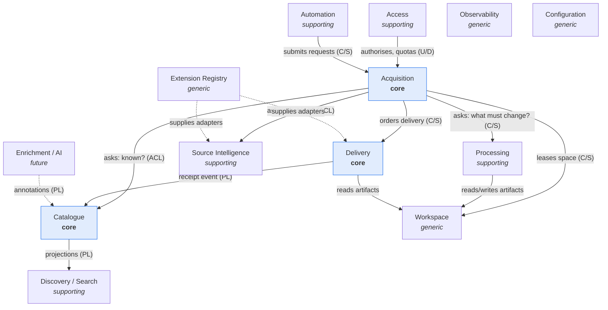

# 02. Bounded Contexts

A bounded context is a boundary inside which one model is consistent and one
team's vocabulary is unambiguous. Crossing the boundary requires **translation**,
not a shared class.

The point is not taxonomy. The point is that "status" means something different
to Acquisition (where a job is in the pipeline) than to Delivery (whether a chat
received a file) than to Catalogue (whether we still hold the bytes). Merging
those into one `status` field is exactly how a system becomes unmaintainable.

---

## 2.1 Context map



`U/D` upstream–downstream · `C/S` customer–supplier · `ACL` anti-corruption
layer · `PL` published language (events)

Configuration and Observability are omitted from most arrows deliberately: they
are ambient, imported by everyone, and depend on nobody.

---

## 2.2 The contexts

### Catalogue — **core**

**Owns.** What MediaHub knows about a piece of media, forever: identity,
provenance, technical facts, custody state, remote references, history.

**Ubiquitous language.** Asset · fingerprint · source reference · custody ·
provenance · duplicate.

**Boundary.** The Catalogue never fetches, never delivers, never schedules. It
answers "have we seen this before?", "where does this live now?", "what did we
do with it?".

**Why it is core.** It is the only thing that survives when the bytes are gone.
The product's memory *is* the product.

**Owns tables.** `media_assets`, `asset_source_refs`, `asset_remote_refs`,
`asset_history`.

---

### Acquisition — **core**

**Owns.** The lifecycle of an acquisition request from submission to terminal
state: admission, stages, attempts, leases, backoff, cancellation, expiry.

**Ubiquitous language.** Request · job · stage · attempt · lease · admission ·
backoff · terminal.

**Boundary.** Acquisition orchestrates but does not perform. It never knows how
yt-dlp works, what FFmpeg flags mean, or what a chat id is. It knows that a
stage succeeded, failed transiently, or failed permanently.

**Why it is core.** The retry/lease/cancellation rules are the difference
between "works on my laptop" and "survives a Pi on domestic power".

**Owns tables.** `acquisition_jobs`, `job_attempts`, `job_events`, `dead_letters`.

---

### Delivery — **core**

**Owns.** Destinations, delivery orders, transfer outcomes, receipts, and
remote artifact references. Provider-agnostic.

**Ubiquitous language.** Destination · delivery · receipt · remote reference ·
capability · custody transfer.

**Boundary.** *No Telegram vocabulary crosses this line.* Not `chat_id`, not
`file_id`, not `message_id`. The context speaks `DeliveryTarget`,
`RemoteArtifactRef`, `RemoteMessageRef`. The Telegram adapter translates in both
directions.

**Why it is core, and separate from Acquisition.** Because delivery outlives
acquisition: an asset acquired in March can be delivered to a new destination in
December, with no download. If delivery were a stage of the acquisition job,
that operation would require a fake job and a lie in the history.

**Owns tables.** `delivery_targets`, `deliveries`, `delivery_receipts`.

---

### Processing — supporting

**Owns.** Deciding *and* performing the transformations that make an artifact
deliverable: remux, transcode, split, thumbnail, strip metadata.

**Split inside the context.** The **plan** is a pure function of
(technical profile, destination capabilities, policy) and lives in the domain,
fully testable without FFmpeg. The **execution** is an adapter. This split is the
whole reason the context is worth having.

**Boundary.** Processing does not choose destinations and does not know why a
constraint exists — it receives constraints as data.

**Owns tables.** none (plans are derived; results live on the job).

---

### Source Intelligence — supporting

**Owns.** Everything about *sources*: URL canonicalisation, provider
identification, probing metadata without downloading, capability discovery
("can this be resumed?", "is there a manifest?"), and provider health.

**Ubiquitous language.** Source reference · provider · probe · manifest ·
canonical form · extractor.

**Why it is separate from Download.** Probing is a read-only, cheap, pre-admission
operation whose result decides whether a job is ever created. Fetching is
expensive, stateful and resumable. Fusing them forces a download before a policy
check — which is how a 40 GB file lands on a 32 GB SD card.

**Boundary.** It never writes payload bytes.

**Owns tables.** `source_providers` (health/state), `probe_cache`.

---

### Workspace — generic

**Owns.** Ephemeral, per-job, quota-checked scratch space; artifact handles;
guaranteed cleanup; disk headroom accounting.

**Boundary.** It has no idea what a media file is. It leases space, hands out
opaque handles, and reclaims them. This is what lets §11's custody rules be
enforced in one place.

**Owns tables.** `workspace_leases`.

---

### Access — supporting

**Owns.** Principals, their linkage to external identities (Telegram user id,
API key), authorisation decisions, quotas and rate limits.

**Boundary.** It answers "may this principal do this?" and "has this principal
exceeded its budget?". It does not know what an acquisition is beyond an
abstract action name.

**Owns tables.** `principals`, `principal_identities`, `quotas`, `audit_log`.

---

### Automation — supporting (future)

**Owns.** Subscriptions and watches: a source plus a schedule plus filters plus
what has already been seen. Produces ordinary acquisition requests.

**Boundary.** Automation must have **no privileged path**. A subscription's
request goes through the same admission, quota and policy checks as a human's.
The day automation gets a shortcut is the day the Pi fills up overnight.

**Owns tables.** `subscriptions`, `subscription_runs`, `seen_markers`.

---

### Discovery / Search — supporting

**Owns.** Read-optimised projections over the catalogue: full-text (SQLite FTS5),
faceted filters, saved queries.

**Boundary.** Read-only, derived, disposable. It may be rebuilt from the
Catalogue at any time and must never be a source of truth. It is allowed to
bypass aggregates for query performance ([05](05-component-communication.md) §5.4).

**Owns tables.** `search_index_*` (FTS5 virtual tables), rebuildable.

---

### Enrichment / AI — future

**Owns.** Optional, asynchronous annotations: tags, summaries, transcripts,
scene detection, translations.

**Boundary.** *Never on the critical path.* An enrichment failure must not fail
an acquisition or delay a delivery. Annotations attach to an asset as an
additive, versioned record; the Catalogue never depends on them existing.

**Owns tables.** `asset_annotations`.

---

### Extension Registry, Configuration, Observability — generic

Infrastructure of the codebase itself: plugin discovery and lifecycle
([15](15-plugin-architecture.md)), typed settings
([13](13-configuration-architecture.md)), health/metrics/logs
([16](16-monitoring.md)). They are generic because there is no competitive
advantage in their model — deliberately boring, deliberately shared.

---

## 2.3 Ownership rules

1. **One context owns each table.** No other context reads or writes it
   directly — not even "just a join, just this once". A join across contexts is
   the first crack; it becomes a shared model within a year.
2. **Cross-context reads go through a port or a projection.** Acquisition asks
   the Catalogue "is this a duplicate?" via a narrow port
   (`DuplicateLookup`), not via `select * from media_assets`.
3. **Cross-context writes go through commands or events.** Delivery does not
   update the Catalogue's custody column; it publishes
   `delivery.succeeded.v1`, and the Catalogue decides what that means to it.
4. **Identifiers cross freely; entities do not.** `AssetId` may appear anywhere.
   `MediaAsset` may not leave the Catalogue.
5. **Shared kernel is minimal and frozen.** Only `domain/common` (entity base,
   value-object base, domain event base, errors, pagination, time). Adding to it
   requires an ADR, because every context pays for every addition.

Enforcement is mechanical, not cultural: the architecture test asserts both the
layer axis and the context axis ([04](04-dependency-graph.md) §4.6).

---

## 2.4 Translation at the boundaries

Three anti-corruption layers earn their keep. Each one exists because the
external model is unstable, ugly, or both.

| ACL | Protects | Translates |
| --- | -------- | ---------- |
| **Telegram adapter** | Delivery, Access | `chat_id`/`file_id`/`message_id` ↔ `DeliveryTarget`/`RemoteArtifactRef`/`RemoteMessageRef`; Telegram user id ↔ `PrincipalId`; Telegram errors ↔ `FailureReport` |
| **Source adapter (yt-dlp/HTTP)** | Source Intelligence, Acquisition | 400-field extractor dicts ↔ a 12-field `SourceProbe`; extractor exceptions ↔ transient/permanent classification |
| **Media toolchain adapter (FFmpeg)** | Processing | `ffprobe` JSON ↔ `TechnicalProfile`; exit codes and stderr ↔ `FailureReport` |

Each ACL is the *only* place where the foreign vocabulary appears. Grep for
`file_id` outside `infrastructure/delivery/telegram/` and the answer must be
zero results — that is a testable architectural assertion, and it is asserted.

---

## 2.5 Contexts deliberately **not** created

Being critical means refusing boundaries too.

| Rejected context | Why |
| ---------------- | --- |
| "Notification" | Delivery already models "send something to a destination". A separate notification context would duplicate targets, receipts and retries. Notifications are a `DeliveryTarget` with a different payload kind. |
| "History" / "Audit" as a context | History is the Catalogue's memory; audit is Access's. Splitting them creates a write-only context nobody owns. |
| "Media Library" | There is no library. The product deliberately does not keep files. Naming a context after a thing that must not exist would legitimise it. |
| "User" | Access already covers identity and authorisation for a single household. A "user" context implies profiles, preferences and social features that do not exist. |
| "Transcoding" separate from Processing | Same model, same constraints, same adapter. One context. |

---

## 2.6 Context → module map

Contexts are the **second level** in every layer, so a context's code is
predictable in all four layers:

```
domain/<context>/           application/<context>/
infrastructure/<context>/   presentation/<channel>/
```

| Context | Module slug |
| ------- | ----------- |
| Catalogue | `catalogue` |
| Acquisition | `acquisition` |
| Delivery | `delivery` |
| Processing | `processing` |
| Source Intelligence | `sources` |
| Workspace | `workspace` |
| Access | `access` |
| Automation | `automation` |
| Discovery / Search | `search` |
| Enrichment / AI | `enrichment` |

Full tree: [19](19-folder-structure.md).

> **Migration note.** Phase 01 shipped `domain/media` and `domain/download`.
> These become `catalogue` and `acquisition`. The rename is mechanical, must
> happen in Phase 03 before more code is written on top, and is justified in
> [20](20-architecture-decision-review.md) §4.6.
