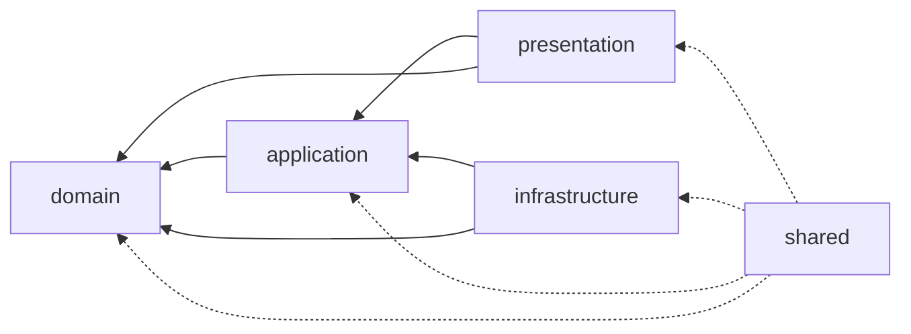
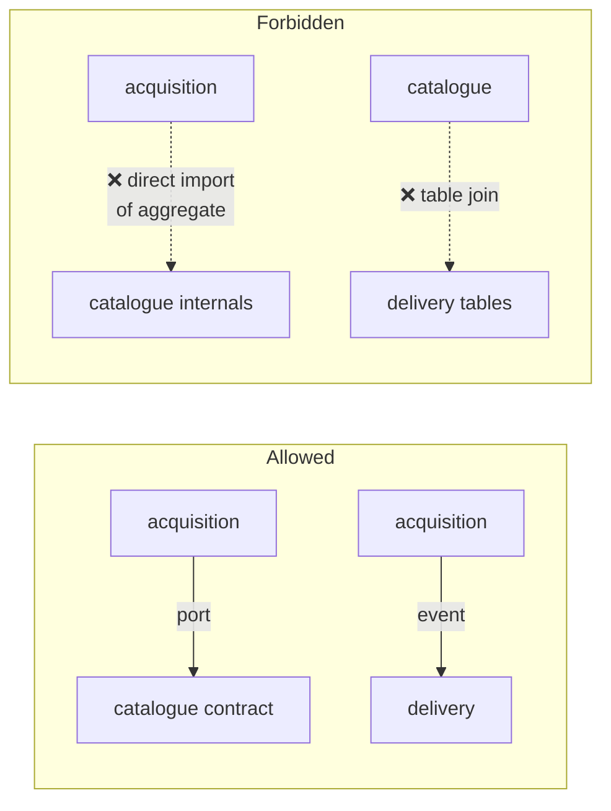

# 04. Dependency Graph

Two independent axes constrain every import:

- **The layer axis** — how far from the core a module sits.
- **The context axis** — which business boundary a module belongs to.

A module must satisfy **both**. Phase 01 enforced only the first, which is why a
future `domain/acquisition` could have imported `domain/catalogue` internals
without any test complaining. That gap closes here.

---

## 4.1 The layer axis



| Layer | May import | May **not** import |
| ----- | ---------- | ------------------ |
| `domain` | `domain`, stdlib | everything else, **including all third-party packages** |
| `application` | `domain`, `application`, `shared`, `loguru` | `infrastructure`, `presentation`, any framework |
| `infrastructure` | `domain`, `application`, `infrastructure`, `shared`, third-party | `presentation` |
| `presentation` | `domain`, `application`, `presentation`, `shared`, its own framework | `infrastructure` — **except** the composition root |
| `shared` | `shared`, stdlib, `pydantic`, `loguru` | every layer, without exception |
| `plugins` (SDK) | `plugins`, stdlib, typing | every layer — the SDK is standalone by design |

### Why each rule exists

**Domain forbids third-party imports.** Not stylistic. A `pydantic` import in an
aggregate means the business rules now version-lock to a validation library;
`pydantic 3` becomes a domain migration. The rule also has a pleasant
side-effect: it is impossible to accidentally do I/O in the domain, because
nothing that does I/O is importable.

**Application forbids frameworks.** A use case that imports `fastapi` cannot be
called from the Telegram gateway, the CLI or a worker. The whole "one core, many
interfaces" promise fails at the first `Depends()` in a use case.

**Infrastructure forbids presentation.** An adapter that imports a router
inverts the arrows and makes the API undeletable.

**Presentation forbids infrastructure outside the composition root.** A router
that imports `SqliteMediaRepository` cannot be tested without a database and
silently couples the HTTP contract to a storage choice. The exemption is
narrow and explicit:

```
presentation/api/app.py
presentation/api/lifespan.py
presentation/api/dependencies.py
presentation/telegram/__main__.py     (planned)
presentation/worker/__main__.py       (planned)
presentation/scheduler/__main__.py    (planned)
presentation/cli/__main__.py          (planned)
```

These are the *only* modules allowed to name a concrete adapter. Everything else
receives ports.

**Shared imports nothing.** It is imported by all four layers; if it could
import a layer, it would create a cycle through the back door. `shared` holds
exactly two things — configuration and logging — and adding a third requires an
ADR.

---

## 4.2 The context axis



Rules, applied inside every layer:

1. A context's **internals** (aggregates, repositories, ORM models, adapters)
   are private to that context.
2. A context's **contract** is public: its identifiers, its published events,
   its DTOs, and the ports it offers to others.
3. Contract modules are named by convention so the rule is checkable:
   - `domain/<context>/identifiers.py` — id value objects, always importable
   - `domain/<context>/events.py` — published events, always importable
   - `application/<context>/contracts.py` — ports offered *to other contexts*
   - everything else — private
4. `domain/common` is the only shared kernel.

### Cross-context matrix

| From ↓ / To → | catalogue | acquisition | delivery | processing | sources | workspace | access | automation | search |
| --- | --- | --- | --- | --- | --- | --- | --- | --- | --- |
| **catalogue** | — | ⛔ | ⛔ | ⛔ | id | ⛔ | ⛔ | ⛔ | ⛔ |
| **acquisition** | contract | — | contract | contract | contract | contract | contract | ⛔ | ⛔ |
| **delivery** | id | ⛔ | — | ⛔ | ⛔ | contract | contract | ⛔ | ⛔ |
| **processing** | ⛔ | ⛔ | id | — | ⛔ | contract | ⛔ | ⛔ | ⛔ |
| **sources** | ⛔ | ⛔ | ⛔ | ⛔ | — | ⛔ | ⛔ | ⛔ | ⛔ |
| **workspace** | ⛔ | ⛔ | ⛔ | ⛔ | ⛔ | — | ⛔ | ⛔ | ⛔ |
| **access** | ⛔ | ⛔ | ⛔ | ⛔ | ⛔ | ⛔ | — | ⛔ | ⛔ |
| **automation** | contract | contract | id | ⛔ | contract | ⛔ | contract | — | ⛔ |
| **search** | event | ⛔ | ⛔ | ⛔ | ⛔ | ⛔ | ⛔ | ⛔ | — |

`contract` = ports/DTOs only · `id` = identifier value objects only ·
`event` = subscribes to published events only · ⛔ = forbidden

Read the matrix as a design review tool: **Acquisition is the hub** (it
orchestrates), **Catalogue is a sink** (it depends on almost nothing, which is
why it survives everything), and **Workspace, Sources and Access are leaves**
(they depend on nobody, so they are trivially testable and replaceable).

If a new feature makes you want to add a `⛔ → contract` cell, that is a design
conversation, not a quick edit.

---

## 4.3 Third-party dependency policy

| Package | Allowed in | Forbidden in |
| ------- | ---------- | ------------ |
| `fastapi`, `starlette` | `presentation/api` | everywhere else |
| `python-telegram-bot` | `infrastructure/delivery/telegram`, `presentation/telegram` | everywhere else |
| `sqlalchemy`, `alembic` | `infrastructure/persistence` | everywhere else |
| `yt_dlp` | `infrastructure/sources/*`, `infrastructure/download/*` | everywhere else |
| FFmpeg (subprocess) | `infrastructure/processing` | everywhere else |
| `pydantic` | `presentation`, `shared/config`, plugin DTOs | `domain`, `application` |
| `loguru` | everywhere except `domain` | `domain` |

The asymmetry for `pydantic` is deliberate: it is a *boundary* validation
library. Boundaries are `presentation` and `shared/config`. Inside, validation
is the value objects' job.

Every row is asserted by the architecture test. Adding a package to the runtime
dependency list requires stating which layer may import it.

---

## 4.4 Dependency inversion in practice

Four inversions carry the architecture. Each follows the same shape: the
**interface belongs to the inner layer**, the **implementation to the outer**.

| Need | Port (inner) | Adapter (outer) | Why inverted |
| ---- | ------------ | --------------- | ------------ |
| Persist an aggregate | `domain/<ctx>/repository.py` | `infrastructure/persistence/…` | SQLite is a detail; the contract is not |
| Fetch bytes | `application/download/ports.py` | `infrastructure/download/ytdlp` | Providers change monthly; the pipeline does not |
| Deliver an artifact | `application/delivery/ports.py` | `infrastructure/delivery/telegram` | Telegram is one destination of many |
| Know the time | `application/common/ports.py` | `infrastructure/system/clock.py` | Determinism in tests |

Adapters are wired in exactly one place —
`infrastructure/di/container.py` — annotated with the **port** type, so mypy
proves conformance at build time.

---

## 4.5 Forbidden patterns, with the failure they prevent

| Pattern | Concrete failure it causes |
| ------- | -------------------------- |
| Importing an adapter inside a use case | Use case untestable without a DB; every test needs Docker |
| Domain importing `pydantic`/`sqlalchemy` | Library upgrade becomes a business-rule migration |
| Telegram vocabulary outside its adapter | `chat_id` in the domain; a second delivery channel needs a rewrite |
| Cross-context table join | Two contexts share a schema; neither can migrate independently |
| Passing an aggregate to a route | Route mutates state outside a transaction; corruption without a stack trace |
| Global mutable state (module-level container, `_settings`) | Tests leak into each other; two apps cannot coexist in one process |
| Reading `os.environ` outside `shared/config` | Untyped, unvalidated, undocumented configuration; boots in production with a typo |
| Business logic in a Telegram handler | Feature exists only in Telegram; the API silently lacks it |
| A worker importing `presentation` | Worker drags in FastAPI; image bloat and a nonsense dependency |
| `time.sleep` / blocking I/O in `api` | One slow provider freezes every request on a single-core-bound Pi |

---

## 4.6 Enforcement

`tests/architecture/` runs on every commit and fails with the exact file and
import. Phase 03 must extend Phase 01's single test into this suite:

| Test | Asserts | Status |
| ---- | ------- | ------ |
| `test_layer_dependencies` | The layer axis (§4.1) | Implemented |
| `test_domain_has_no_third_party` | Domain imports stdlib only | Implemented |
| `test_composition_root_only` | Presentation → infrastructure only in listed modules | Implemented |
| `test_every_module_documented` | Module docstring present | Implemented |
| `test_context_boundaries` | The context matrix (§4.2) | **Planned** |
| `test_third_party_placement` | The package table (§4.3) | **Planned** |
| `test_no_foreign_vocabulary` | `chat_id`/`file_id`/`ytdl`/`ffmpeg` appear only in their adapter | **Planned** |
| `test_no_global_state` | No module-level mutable singletons outside `shared.config` | **Planned** |
| `test_ports_have_two_implementations` | Every port has a real adapter *and* a test double | **Planned** |

The last one is unusual and worth keeping: a port with a single implementation
and no test double is usually a premature abstraction, and this test surfaces it
instead of letting it accumulate.

**Enforcement is not optional or advisory.** A rule that only lives in this
document will be broken within a quarter, by someone reasonable, under deadline.
