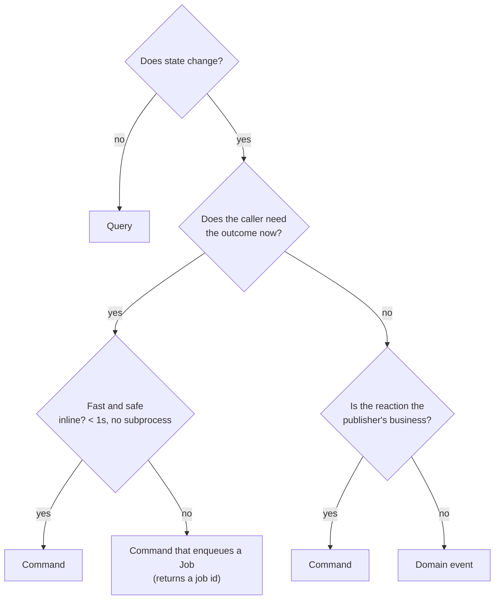
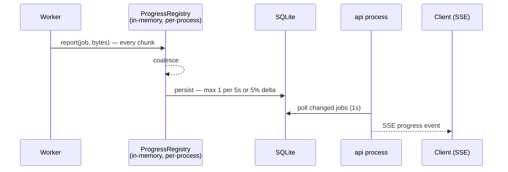

# 05. Component Communication

Four mechanisms, each with a single legitimate use. Picking the wrong one is how
systems become impossible to reason about, so the choice is constrained here
rather than left to taste.

| Mechanism | Direction | Coupling | Use when |
| --------- | --------- | -------- | -------- |
| **Command** | caller → one handler | caller knows the handler | Something must happen, and the caller cares whether it did |
| **Query** | caller → one handler | caller knows the handler | Something must be read, no state changes |
| **Domain event** | publisher → 0..N subscribers | publisher knows nothing | Something *has happened*, and others may care |
| **Job** | producer → queue → one worker | fully decoupled, durable | Work is slow, retryable, or must survive a restart |

---

## 5.1 Decision rule



The two arrows people get wrong:

- **"Does the caller need the outcome now?"** A download takes minutes. The HTTP
  caller gets `202 Accepted` and a job id, not a held connection.
- **"Is the reaction the publisher's business?"** If the Catalogue *must* update
  when delivery succeeds, that is not an event, that is a command — model it
  honestly. Events are for reactions the publisher is entitled to be ignorant
  of (search indexing, metrics, notifications, AI enrichment).

---

## 5.2 Commands

**Shape.** One use case class, one `execute(request) -> response`, one
transaction, defined in `application/<context>/use_cases/`.

**Naming.** Imperative: `SubmitAcquisitionRequest`, `CancelJob`,
`DeliverAsset`, `RegisterDestination`.

**Rules.**

1. A command is handled **exactly once**, by **exactly one** handler.
2. A command handler owns its transaction boundary. It never joins someone
   else's.
3. A command may enqueue jobs and publish events; it may not call another
   command handler. Chained commands hide transaction boundaries and produce
   partial writes. If two things must happen together, they belong in one
   handler or in a job.
4. Commands are the **only** entry point for state change. HTTP, Telegram, CLI
   and the worker all go through the same handlers — this is what makes the
   "many interfaces, one core" claim true instead of aspirational.

**Idempotency.** Every externally-triggered command accepts an optional
`idempotency_key`. A retried Telegram update (they do repeat) or a
double-tapped button must not create two jobs. Keys are stored with the result
for a bounded window (24 h) and replayed rather than re-executed.

---

## 5.3 Queries

**Shape.** `application/<context>/queries/`, returning read DTOs.

**Rules.**

1. Queries never mutate. Not even a "last accessed" timestamp — that is a
   command, or an event.
2. Queries **may bypass aggregates** and read projections directly. Loading and
   rehydrating 200 aggregates to render a list is a real cost on a Pi, and the
   consistency guarantees of an aggregate are worthless for a read.
3. Queries never return domain entities — always DTOs
   ([06](06-domain-model.md) §6.9).

This is CQRS-lite: separate models, same database, same transaction system, no
eventual-consistency machinery. Full CQRS is explicitly rejected — the
complexity is unjustified for one node and one user.

---

## 5.4 Read models and projections

| Read model | Source | Freshness | Rebuildable |
| ---------- | ------ | --------- | ----------- |
| Job list / detail | direct query on owning tables | strong | n/a |
| Asset list / detail | direct query on owning tables | strong | n/a |
| Search index (FTS5) | catalogue events | eventual (seconds) | yes, from scratch |
| Live progress | in-memory registry + SSE | real-time | no (transient by design) |
| Dashboard counters | aggregate queries, cached 5 s | eventual | yes |

Only the search index is a true projection. Everything else queries the owning
tables directly, because on a single-node SQLite deployment a "projection" of
data that lives three milliseconds away is pure ceremony.

---

## 5.5 Domain events

**Shape.** Immutable, keyword-only frozen dataclasses carrying primitives only
(already established in Phase 01). Recorded by aggregates, drained by the
application **after commit**, published through `EventPublisher`.

**Naming and versioning.** `<context>.<aggregate>.<past-tense>.v<N>`.

**Event catalogue** — this is a published contract; treat it like an API.

| Event | Published by | Consumed by | Payload |
| ----- | ------------ | ----------- | ------- |
| `catalogue.asset.registered.v1` | Catalogue | Search, Metrics | asset_id, source_url, kind, principal_id |
| `catalogue.asset.fingerprinted.v1` | Catalogue | Dedup, Search | asset_id, algorithm, digest, bytes |
| `catalogue.asset.custody_changed.v1` | Catalogue | Workspace, Metrics | asset_id, from, to |
| `catalogue.asset.forgotten.v1` | Catalogue | Search, Enrichment | asset_id |
| `acquisition.job.submitted.v1` | Acquisition | Metrics, Automation | job_id, asset_id, principal_id, priority |
| `acquisition.job.stage_completed.v1` | Acquisition | Metrics, Progress | job_id, stage, duration_ms |
| `acquisition.job.failed.v1` | Acquisition | Notifications, Metrics | job_id, stage, failure_kind, code, retryable |
| `acquisition.job.completed.v1` | Acquisition | Catalogue, Notifications | job_id, asset_id, duration_ms |
| `acquisition.job.dead_lettered.v1` | Acquisition | Alerting | job_id, attempts, last_failure |
| `delivery.requested.v1` | Delivery | Metrics | delivery_id, asset_id, target |
| `delivery.succeeded.v1` | Delivery | **Catalogue**, Notifications, Metrics | delivery_id, asset_id, receipt, remote_ref |
| `delivery.failed.v1` | Delivery | Notifications, Metrics | delivery_id, failure_kind, code |
| `workspace.lease_expired.v1` | Workspace | Metrics, Alerting | lease_id, job_id, bytes |
| `access.quota_exceeded.v1` | Access | Notifications, Audit | principal_id, quota, window |

`delivery.succeeded.v1` is the load-bearing one: it is what tells the Catalogue
that remote custody exists, which is what permits local deletion
([11](11-storage-strategy.md) §11.3).

**Versioning policy.**

- Adding an optional field → same version.
- Removing or retyping a field → new version; publish both for one release
  cycle, then retire the old.
- Renaming an event → new event; the old one is deprecated, never mutated.

**Delivery guarantees.**

| Consumer class | Guarantee | Mechanism |
| -------------- | --------- | --------- |
| Metrics, logging | best effort, in-process | direct dispatch after commit |
| Search indexing | at-least-once | **outbox table** + scheduler drain |
| Anything that triggers work | at-least-once | outbox → job enqueue |

**The outbox is not optional** for the second and third classes. "Commit, then
publish in-process" loses the event on a power cut between the two — which on a
Pi is a weekly occurrence, not a thought experiment. Events are written to an
`outbox` table **inside the same transaction** as the state change, then drained
by the scheduler. Consumers must be idempotent, because at-least-once means
duplicates.

Phase 01's `LoggingEventPublisher` implements only the first class. That is
sufficient today and insufficient the moment an event triggers work — see
[20](20-architecture-decision-review.md) §4.11.

---

## 5.6 Jobs (asynchronous work)

The queue is the boundary between "the caller's request" and "the machine's
work". Full design: [09](09-queue-architecture.md).

**Contract.**

- Producers enqueue with a payload of **identifiers, never objects**. A job
  payload that embeds an aggregate is stale by the time it is claimed.
- Every job is idempotent at the stage level; re-running a completed stage is a
  no-op.
- Jobs never call back into the producer synchronously. The result is state
  plus events.

**Job classes** (separate lanes, separate concurrency budgets):

| Class | Typical duration | Concurrency (Pi 4) | Priority |
| ----- | ---------------- | ------------------ | -------- |
| `acquisition` | seconds–hours | 1–2 | user-driven |
| `delivery` | seconds–minutes | 1–2 | high (short, user-visible) |
| `maintenance` | seconds | 1 | lowest |
| `enrichment` | minutes | 0–1 | lowest, opt-in |

Separate lanes matter: a 3-hour download must not block a 5-second re-delivery.
A single FIFO queue would make the product feel broken while working correctly.

---

## 5.7 Synchronous call rules

| Caller | Callee | Allowed | Notes |
| ------ | ------ | ------- | ----- |
| Presentation | Application command/query | ✅ | The only inbound path |
| Application | Port | ✅ | Always through an interface |
| Application | Application (other context) | ⚠️ | Only via a declared contract port |
| Application | Application (same context) | ❌ | See §5.2 rule 3 |
| Domain | anything outside domain | ❌ | Ever |
| Infrastructure | Application | ✅ | Adapters implement application ports |
| Worker | Application command | ✅ | Workers are just another interface |

**Timeouts are mandatory on every outbound call.** No exceptions. An adapter
without a timeout is a hang waiting for a bad night: on a Pi, a stuck socket
holds a worker slot forever and the queue silently stops. Every port's contract
states its timeout budget, and the adapter enforces it.

---

## 5.8 Error propagation across boundaries

```
domain error / application error
        ↓  (raised, never caught in between)
use case boundary
        ↓
┌───────────────┬──────────────────┬────────────────────┐
│ HTTP          │ Telegram         │ Worker             │
│ category →    │ category →       │ category →         │
│ status + code │ user-facing text │ TRANSIENT/PERMANENT│
│ (RFC 9457)    │ + audit entry    │ → retry or DLQ     │
└───────────────┴──────────────────┴────────────────────┘
```

Each interface translates the **same** error taxonomy into its own idiom. This
is why the taxonomy lives in the domain and carries a stable `code`: three
translations, one source of truth. Adding a fourth interface adds a translation
table, not a new error model.

---

## 5.9 Live progress — the special case

Progress is high-frequency (many updates per second), low-value individually,
and must not touch the disk at that rate. SD-card write amplification is a real
hardware failure mode, not a theoretical concern.



Rules:

- The **authoritative, durable** progress is the checkpoint in the database.
- The **live** progress is best-effort and may be lost on restart.
- A client that reconnects gets the durable value and resumes streaming.
- Cross-process live progress (worker → api) goes through the throttled database
  write, not a socket. One mechanism, one failure mode, adequate for 1 s
  granularity.

If sub-second cross-process progress is ever required, the correct addition is a
small unix-socket pub/sub — not Redis, and not more database writes.
