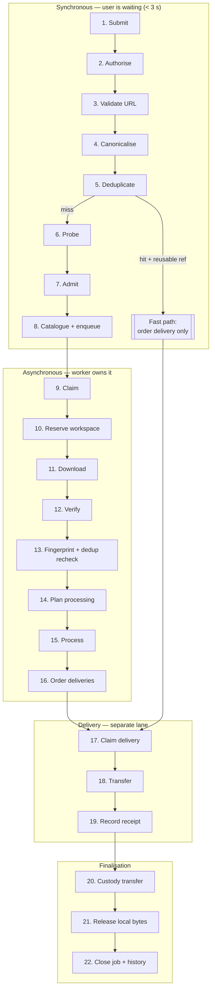
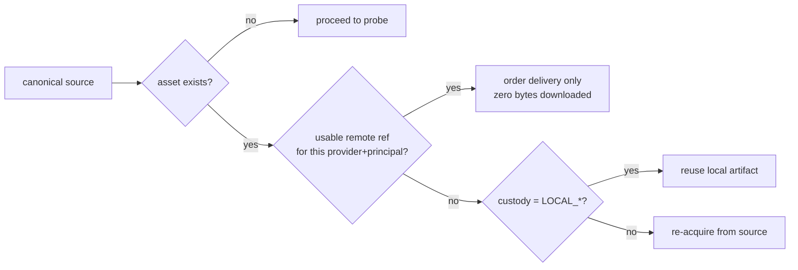
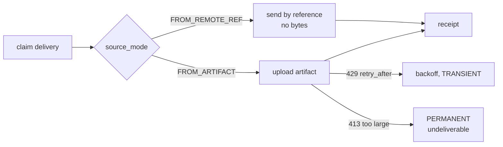
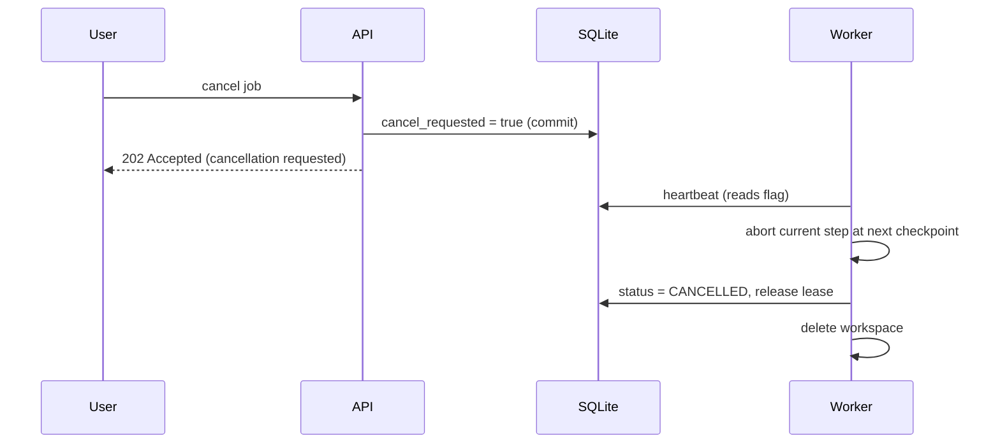

# 07. Download Pipeline

The end-to-end lifecycle, from a person pasting a link to the device forgetting
the file.

**Governing property:** every stage is a **checkpoint**. A power cut resumes at
the last completed stage. A crash never loses a receipt and never leaks a file.

---

## 7.1 Overview



Three lanes, three ownerships: the **request** is synchronous and cheap, the
**acquisition** is a long job, the **delivery** is a short job. Merging them
would mean a 3-hour download blocks a 5-second re-send, and a delivery retry
re-downloads the file.

---

## 7.2 Synchronous phase — admission

The user is waiting. Budget: **< 3 s total**, of which the probe may take 2 s.
Everything here can refuse; nothing here can consume significant disk or CPU.

### 1. Submit

Entry from any interface: `POST /api/v1/downloads`, a Telegram message, a CLI
call, a subscription tick. All construct the same
`SubmitAcquisitionCommand(raw_url, principal_id, destinations?, priority?,
idempotency_key?)`.

`destinations` defaults to the principal's default target — for Telegram, the
chat the message arrived from, resolved by the **gateway**, not by the core.

### 2. Authorise

`AuthorizationPolicy` + `RateLimitPolicy` + `Quota`. Denials are audited.
Rate limiting happens **here**, before the probe, because probing is a network
call to a third party and is exactly what an abusive client would want to
amplify.

### 3. Validate URL — the SSRF gate

`UrlPolicy` ([14](14-security-architecture.md) §14.3):
scheme allow-list → parse → resolve DNS → reject private/loopback/link-local/
multicast/reserved ranges → length and credential checks. Applied again on every
redirect, inside the adapter.

Failure is `POLICY`, terminal, audited. No job is created.

### 4. Canonicalise

`SourceCanonicalizer` produces the `SourceRef` that defines identity. Recorded
with its `canonicalization_version`.

### 5. Deduplicate (pre-download)



**This is the single highest-value optimisation in the product.** A repeat
request for something already delivered costs one Telegram API call: no
download, no disk, no CPU, no queue. On a Pi that turns a 20-minute operation
into 400 ms.

### 6. Probe

`SourceIntelligence.probe(source)` — metadata only, no payload bytes. Returns
`SourceProbe` (title, kind, duration, expected size, formats, resumable, live).
Cached briefly (`probe_cache`) so a double-submit does not double-probe.

Probes are bounded: hard timeout (default 10 s), hard output size limit, run in
the same confinement as the downloader.

### 7. Admit

`AdmissionPolicy` — the gate that keeps the device alive:

| Check | Refuse when | Failure code |
| ----- | ----------- | ------------ |
| Size | `expected_bytes > max_item_bytes` | `item_too_large` |
| Size vs disk | `expected_bytes × safety_factor > free_headroom` | `insufficient_disk` |
| Duration | `duration > max_duration` | `item_too_long` |
| Kind | kind not in allow-list | `unsupported_kind` |
| Liveness | `is_live` and live capture disabled | `live_source_unsupported` |
| Deliverability | planner says `Undeliverable` for **every** destination | `undeliverable` |
| Quota | principal over budget | `quota_exceeded` |
| Provider health | circuit open for this provider | `provider_unavailable` |
| Concurrency | principal at `max_concurrent` | `too_many_active_jobs` |

The **deliverability pre-check** matters: refusing a 4-hour 8K video in 300 ms
is infinitely better than discovering after a 3-hour download that it cannot be
sent. `expected_bytes` is a hint, so the ceiling is re-enforced during streaming
(§7.3 stage 11).

### 8. Catalogue + enqueue

One transaction:

1. `MediaAsset` created (`custody=NONE`) or fetched.
2. `AcquisitionJob` created via factory (`QUEUED`, `stage=ADMITTED`).
3. Outbox rows for `asset.registered`, `job.submitted`.

The caller receives `202 Accepted` with `job_id` and a progress stream URL.

---

## 7.3 Asynchronous phase — acquisition

Owned by a worker holding a lease. Details in [10](10-worker-architecture.md).

### 9. Claim

Atomic claim of the highest-priority due job, taking a lease
([09](09-queue-architecture.md) §9.4). Status → `DOWNLOADING`.

### 10. Reserve workspace

`WorkspaceLease` for `expected_bytes × 2.2` (input + processed output +
headroom). Reservation is accounted, so two workers cannot each believe the last
gigabyte is theirs. Failure → `TRANSIENT`, backoff.

### 11. Download

`DownloaderPort.fetch(request, progress_sink, cancel_token)`.

Enforced **during** the stream, not after:

| Guard | Behaviour on breach |
| ----- | ------------------- |
| Byte ceiling | abort, `POLICY`, `item_too_large` |
| Stall timeout (no bytes for N s) | abort, `TRANSIENT` |
| Total wall-clock cap | abort, `TRANSIENT` with reduced priority |
| Cancellation token | abort promptly, `CANCELLED` |
| Disk headroom drop | abort, `TRANSIENT` |

Progress goes to the in-memory registry; the durable checkpoint is written at
most every 5 s or 5% ([05](05-component-communication.md) §5.9).

Resumption: if the provider supports it, a resume token is checkpointed and a
reclaimed job continues rather than restarting. This is worth real complexity —
restarting a 2 GB download after a 90% power cut is the difference between a
usable product and an unusable one on a domestic connection.

### 12. Verify

Size matches what was written · MIME sniffed from content (never trusted from
headers or extension) · container parses · filename sanitised and contained
([14](14-security-architecture.md) §14.4).

Mismatch → `PERMANENT` (`corrupt_download`), no retry: retrying a deterministic
corruption wastes an hour.

### 13. Fingerprint + post-download dedup

Content hash computed streaming (not by re-reading the file). Then a **second**
duplicate check: two different URLs frequently resolve to identical bytes. On a
hit with a reusable remote ref, the freshly downloaded copy is discarded and the
job jumps to delivery-by-reference — the download is wasted but everything after
it is saved.

`MediaAsset.fingerprint_as(...)`, custody → `LOCAL_ONLY`.

### 14. Plan processing

`ProcessingPlanner(profile, constraints_of_all_destinations, policy)`.

- Empty plan → skip stage 15 entirely (the common case for already-compatible
  media; skipping is a first-class outcome, not an edge case).
- `Undeliverable` → `POLICY` failure, terminal.
- Plan exceeding `max_cpu_seconds` → refuse rather than run for 8 hours.

### 15. Process

Steps executed in order, each producing new artifacts; each step is a
checkpoint. FFmpeg runs confined (§14.6) with a hard wall-clock cap.

Splitting produces N artifacts and therefore N deliveries — modelled explicitly
so partial delivery is visible rather than silently "done".

### 16. Order deliveries

For each destination: create a `Delivery` (`source_mode=FROM_ARTIFACT`) and
enqueue it in the delivery lane. The acquisition job moves to `SENDING` and
**waits** — it does not perform the transfer. The job completes when all its
deliveries reach a terminal state.

---

## 7.4 Delivery phase

### 17–18. Claim and transfer



Provider rate limits are **normal traffic**, not incidents: `429` with
`retry_after` sets `available_at` precisely rather than guessing at backoff.

### 19. Record receipt

`DeliveryReceipt` + `RemoteArtifactRef` persisted, `delivery.succeeded.v1`
emitted through the outbox. **This is the durability point** — after this
transaction commits, the bytes are recoverable from the destination.

---

## 7.5 Finalisation — the part everything else exists to protect

### 20. Custody transfer

The Catalogue consumes `delivery.succeeded.v1`:
`record_remote_copy(ref)` → custody `LOCAL_AND_REMOTE`.

`CustodyPolicy` then decides:

| Condition | Decision |
| --------- | -------- |
| ≥1 verified ref on a `can_serve_back` destination, `retain_local=false` | `RELEASE_LOCAL` |
| `retain_local=true` (user override) | `RETAIN_FOREVER` |
| Only non-serving destinations (webhook, email) | `KEEP_LOCAL` until a serving one exists, then release |
| Any destination still pending | `KEEP_LOCAL` |

### 21. Release local bytes

`release_local_copy()` → custody `REMOTE_ONLY`, then the workspace lease is
released and the files are deleted.

**Ordering is deliberate and must not be "optimised":**

```
1. commit receipt        (durable proof of remote custody)
2. commit custody change (asset now REMOTE_ONLY)
3. delete files          (idempotent, retryable, sweepable)
```

Deleting before committing risks losing both copies. Deleting after committing
risks a leaked file — which a sweep fixes automatically
([11](11-storage-strategy.md) §11.6). One failure mode is data loss; the other
is disk usage. The order is chosen accordingly.

### 22. Close job and record history

Job → `COMPLETED`. Retained forever: asset id, source URL, title, technical
profile, fingerprint, remote refs (file id, message id), receipts, timings,
attempt history, failure reports.

Deleted: every byte of media.

---

## 7.6 Cancellation

Cancellation is **cooperative** — there is no safe way to kill a worker
mid-write and guarantee no corruption.



Guarantees: cancellation is honoured within one heartbeat period (≤30 s) or one
chunk boundary. A job cancelled during `SENDING` may still be delivered — the
API says so explicitly, and the receipt is recorded regardless, because a
delivery that reached the user must be remembered.

---

## 7.7 Failure handling per stage

| Stage | Typical failure | Classification | Retryable |
| ----- | --------------- | -------------- | --------- |
| Validate | private IP, bad scheme | `POLICY` | no |
| Probe | provider 5xx / timeout | `TRANSIENT` | yes |
| Probe | unsupported site, 404 | `PERMANENT` | no |
| Admit | too large, quota | `POLICY` | no |
| Workspace | insufficient disk | `TRANSIENT` | yes, with delay |
| Download | connection reset, 429 | `TRANSIENT` | yes, resume |
| Download | 403 geo-block, DRM | `PERMANENT` | no |
| Download | exceeds ceiling mid-stream | `POLICY` | no |
| Verify | corrupt / mismatch | `PERMANENT` | no |
| Process | FFmpeg non-zero exit | `PERMANENT` | no |
| Process | timeout / OOM | `TRANSIENT` | once, then permanent |
| Deliver | 429, 5xx, network | `TRANSIENT` | yes |
| Deliver | 413 too large, bad target | `PERMANENT` | no |
| Cleanup | file busy | `TRANSIENT` | yes, sweeper |

Two rules that save more time than any other:

- **Never retry a `PERMANENT` failure.** Retrying a DRM error three times with
  exponential backoff wastes an hour and teaches the user that the product is
  slow and unreliable.
- **Never treat an unknown failure as `PERMANENT`.** Unknown defaults to
  `TRANSIENT` with a low attempt cap (2), so a novel error gets one honest
  retry and then a dead letter a human can read.

---

## 7.8 Worked example — the happy path

| t | Event | Custody | Disk |
| - | ----- | ------- | ---- |
| 0.0 s | User sends URL in Telegram | — | 0 |
| 0.1 s | Gateway → `SubmitAcquisitionCommand` | — | 0 |
| 0.3 s | Authorised, URL validated, canonicalised, no duplicate | — | 0 |
| 1.4 s | Probe: 240 MB, 12 min, mp4/h264 | — | 0 |
| 1.5 s | Admitted; asset + job created; `202` | `NONE` | 0 |
| 2 s | Worker claims, leases 530 MB | `NONE` | 0 |
| 3 s–4 min | Download, progress checkpointed every 5 s | `NONE` | 240 MB |
| 4:05 | Verified, fingerprinted | `LOCAL_ONLY` | 240 MB |
| 4:06 | Plan: empty (already deliverable) | `LOCAL_ONLY` | 240 MB |
| 4:07 | Delivery ordered and claimed | `LOCAL_ONLY` | 240 MB |
| 5:30 | Uploaded; receipt with remote ref committed | `LOCAL_AND_REMOTE` | 240 MB |
| 5:31 | Custody transfer | `LOCAL_AND_REMOTE` | 240 MB |
| 5:32 | Local bytes released | **`REMOTE_ONLY`** | **0** |
| 5:32 | Job `COMPLETED`, history written | `REMOTE_ONLY` | 0 |

Steady-state disk cost of an acquisition: **a few hundred bytes of metadata.**

And the second time anyone asks for the same URL:

| t | Event | Disk |
| - | ----- | ---- |
| 0.3 s | Dedup hit, reusable remote ref found | 0 |
| 0.4 s | Delivery ordered `FROM_REMOTE_REF` | 0 |
| 0.8 s | Delivered by reference; receipt recorded | 0 |
