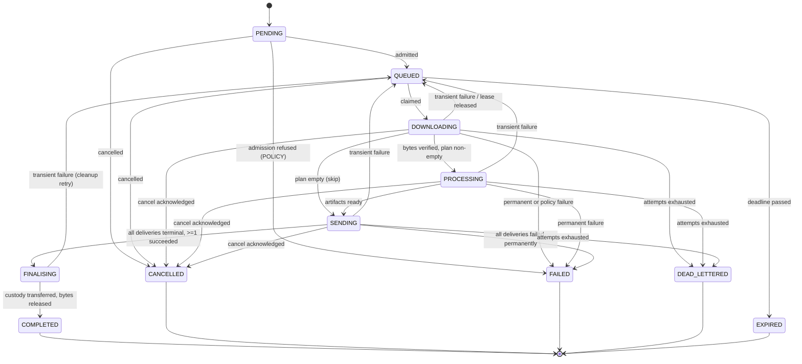
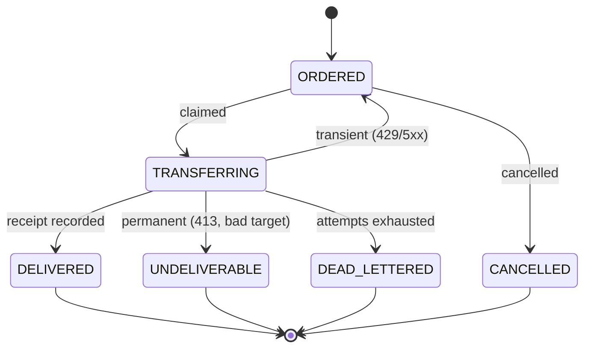
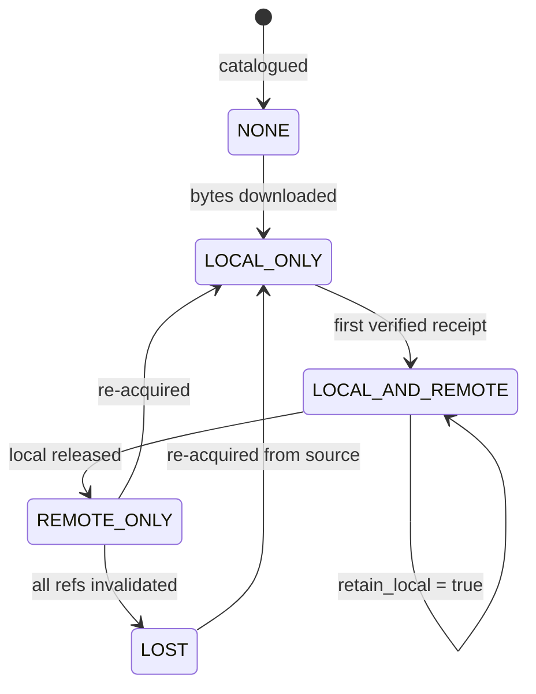

# 08. State Machine

State machines are the cheapest correctness tool available: they turn "that
shouldn't happen" into a raised exception at the exact moment it is attempted.

Three machines, one per aggregate that has a lifecycle: **AcquisitionJob**,
**Delivery**, **Asset custody**. They are deliberately separate — fusing them
produced Phase 01's mistake of one `status` meaning three things.

---

## 8.1 Critique of the requested state list

The brief asks for: Queued, Pending, Downloading, Processing, Sending,
Completed, Cancelled, Failed, Retry, Expired. Reviewing them honestly:

| Requested | Verdict | Reasoning |
| --------- | ------- | --------- |
| Pending | **Keep, redefined** | Genuinely distinct: accepted but *not yet admissible* (awaiting probe/admission). Merging it with Queued hides why nothing is happening. |
| Queued | Keep | Admissible, waiting for a worker. |
| Downloading | Keep | Operators think in stages; hiding them behind `RUNNING` costs observability. |
| Processing | Keep | As above. |
| Sending | Keep | As above. |
| Completed | Keep | Terminal. |
| Cancelled | Keep | Terminal. |
| Failed | Keep, **split by kind** | `FAILED` alone cannot express "will retry" vs "gave up". |
| **Retry** | **Reject as a state** | Retry is *waiting to run again* — identical to `QUEUED` with a future `available_at`. A separate state duplicates the claim query, doubles the transition table, and creates a class of bugs where a job is `RETRY` but never re-queued. Retry is a **transition**, made visible with `attempts` and `available_at`. |
| Expired | Keep | Terminal. Distinct from failure: nothing went wrong, the work stopped being worth doing. |

Added because they are needed and were missing:

| Added | Why |
| ----- | --- |
| `DEAD_LETTERED` | Distinguishes "retries exhausted, needs a human" from "failed permanently on the first try". Different alerting, different operator action. Without it, the DLQ has no state to select on. |

Result: **10 statuses**, one fewer than requested, expressing strictly more.

---

## 8.2 AcquisitionJob states

| Status | Meaning | Leased? | Terminal? |
| ------ | ------- | ------- | --------- |
| `PENDING` | Accepted; probing/admission in flight | no | no |
| `QUEUED` | Admissible; waiting for a worker (**includes retry backoff** via `available_at`) | no | no |
| `DOWNLOADING` | Worker fetching bytes | **yes** | no |
| `PROCESSING` | Worker transforming artifacts | **yes** | no |
| `SENDING` | Deliveries ordered; awaiting their terminal states | **yes** | no |
| `FINALISING` | Custody transfer + local release | **yes** | no |
| `COMPLETED` | Delivered and cleaned up | no | **yes** |
| `CANCELLED` | Stopped on request | no | **yes** |
| `FAILED` | Permanent or policy failure | no | **yes** |
| `DEAD_LETTERED` | Retries exhausted; awaiting a human | no | **yes** |
| `EXPIRED` | Deadline passed before execution | no | **yes** |

`FINALISING` is not decoration: without it, a crash between "delivered" and
"cleaned up" leaves a job in `SENDING` with a receipt — ambiguous, and the
sweeper cannot tell whether delivery is still in flight.

**Invariant:** `lease IS NOT NULL ⇔ status ∈ {DOWNLOADING, PROCESSING, SENDING,
FINALISING}`. Asserted in the domain and by a database check constraint.

---

## 8.3 Transition diagram

Note what is **absent**: no arrow from a terminal state back into the machine.
Re-running a dead job creates a *new* job that references the old one
(`retry_of`). This keeps history immutable and makes "how many times did we try
this URL?" answerable.

---

## 8.4 Transition table

| From | Event | Guard | To | Side effects |
| ---- | ----- | ----- | -- | ------------ |
| `PENDING` | `admit` | admission passed | `QUEUED` | set `available_at=now`, emit `job.submitted` |
| `PENDING` | `refuse` | policy failure | `FAILED` | audit entry, emit `job.failed` |
| `QUEUED` | `claim` | `available_at ≤ now` ∧ no lease ∧ ¬`cancel_requested` | `DOWNLOADING` | `attempts += 1`, take lease, emit `job.started` |
| `QUEUED` | `expire` | `now > expires_at` | `EXPIRED` | emit `job.expired` |
| `QUEUED` | `cancel` | — | `CANCELLED` | emit `job.cancelled` |
| running\* | `heartbeat` | lease owned | same | extend lease |
| running\* | `checkpoint` | lease owned | same | persist stage + progress |
| `DOWNLOADING` | `downloaded` | verified ∧ fingerprinted | `PROCESSING` ∨ `SENDING` | custody → `LOCAL_ONLY` |
| `PROCESSING` | `processed` | all steps done | `SENDING` | record artifacts |
| `SENDING` | `deliveries_settled` | ≥1 delivered | `FINALISING` | — |
| `SENDING` | `deliveries_settled` | 0 delivered, all permanent | `FAILED` | emit `job.failed` |
| `FINALISING` | `finalised` | custody = `REMOTE_ONLY` ∨ retained | `COMPLETED` | release workspace, emit `job.completed` |
| running\* | `fail(TRANSIENT)` | `attempts < max` | `QUEUED` | `available_at = now + backoff`, release lease |
| running\* | `fail(TRANSIENT)` | `attempts ≥ max` | `DEAD_LETTERED` | write dead letter, release lease, alert |
| running\* | `fail(PERMANENT\|POLICY)` | — | `FAILED` | release lease, release workspace |
| running\* | `release` | shutdown | `QUEUED` | release lease, **no** attempt increment |
| running\* | `acknowledge_cancel` | `cancel_requested` | `CANCELLED` | release lease + workspace |

\* running = `DOWNLOADING`, `PROCESSING`, `SENDING`, `FINALISING`

**`release` must not increment `attempts`.** A graceful shutdown or an expired
lease is not the job's fault; charging it an attempt means a nightly reboot
eventually dead-letters healthy work. This distinction is easy to miss and
expensive to debug.

---

## 8.5 Delivery states

`DELIVERED` requires a persisted receipt. There is no "probably delivered".

**Partial success is normal and must be modelled:** three destinations, two
delivered, one undeliverable → the job completes, custody transfers (a serving
destination succeeded), and the failure is recorded per delivery. The user is
told exactly which destination failed and why.

---

## 8.6 Asset custody states

`REMOTE_ONLY` is the **steady state** of the product. Every other state is
transient, and any asset that stays in `LOCAL_*` for longer than
`max_local_retention` is a bug that the sweeper reports and the metrics expose.

---

## 8.7 Concurrency and enforcement

Three layers, because one is never enough:

1. **Domain** — the transition table above; illegal transitions raise
   `InvalidStateTransition`. Unit-tested exhaustively (every pair).
2. **Database** — the claim is a conditional `UPDATE … WHERE status='queued'`
   ([09](09-queue-architecture.md) §9.4). Two workers cannot both win.
3. **Optimistic concurrency** — a `version` column, incremented per save, with
   `WHERE version = :expected`. A stale write raises `ConcurrentModification`
   rather than silently overwriting. Required because the API, the worker and
   the scheduler can all touch one job.

Phase 01 has neither the version column nor the check constraint. Both are
required in Phase 03 ([20](20-architecture-decision-review.md) §4.7).

---

## 8.8 Time-based transitions

| Transition | Trigger | Owner |
| ---------- | ------- | ----- |
| `QUEUED → DOWNLOADING` | `available_at ≤ now` | evaluated at claim time — **no timer** |
| `QUEUED → EXPIRED` | `now > expires_at` | Scheduler sweep, 5 min |
| running → `QUEUED` (lease reclaim) | `lease.expires_at < now` | Scheduler reaper, 30 s |
| `ORDERED → TRANSFERRING` | `available_at ≤ now` | claim time |

Only two timers exist, both in the Scheduler. Retry backoff deliberately has
**no** timer: `available_at` is a predicate on the claim query. Fewer moving
parts, no drift, nothing to miss while the device is off.

---

## 8.9 Terminal-state semantics

| State | User sees | Retryable by user | Retained | Alerts |
| ----- | --------- | ----------------- | -------- | ------ |
| `COMPLETED` | "Sent ✓" + link | resend (delivery only) | forever | no |
| `CANCELLED` | "Cancelled" | resubmit | forever | no |
| `FAILED` | Reason + code | resubmit (new job) | forever | no |
| `DEAD_LETTERED` | "Failed after N attempts" | requeue from DLQ | forever + payload | **yes** |
| `EXPIRED` | "Expired before it ran" | resubmit | forever | if frequent |

Every terminal state keeps its history row permanently. History is metadata and
costs bytes, not gigabytes — the thing the product deletes is media, never
memory.
