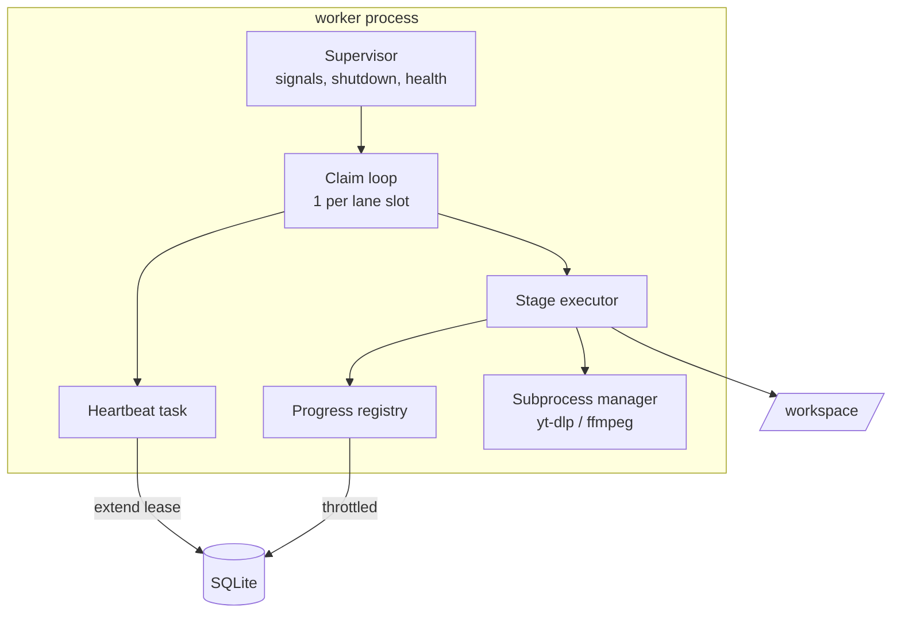
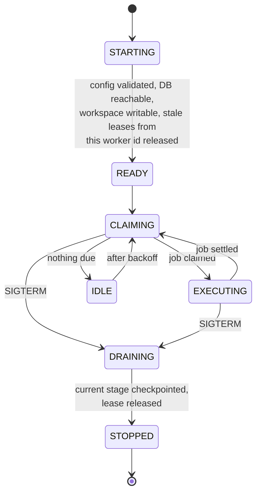
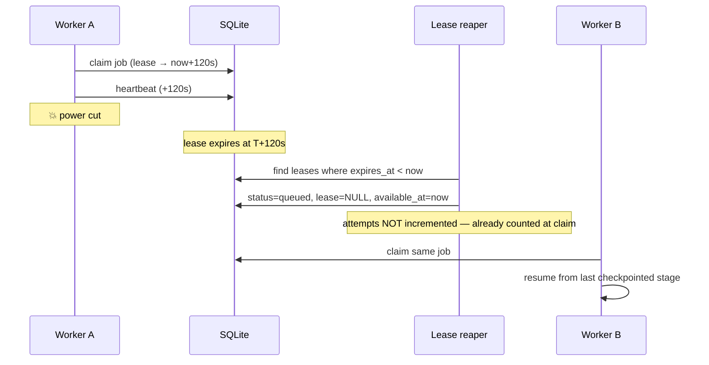

# 10. Worker Architecture

A worker is a process that repeatedly claims one job, executes its stages, and
reports the outcome. It is intentionally the **dumbest** component in the
system: no policy, no scheduling decisions, no business rules. All of those live
in the domain, where they are testable without a process.

---

## 10.1 Why a separate process

Not a thread, not a background task in the API.

| Reason | Consequence if ignored |
| ------ | ---------------------- |
| Work is **blocking** (yt-dlp, FFmpeg subprocesses) | One transcode freezes every HTTP request on a Pi |
| Work is **memory-hungry** and occasionally leaks | The API dies with it |
| Work must be **restartable independently** | Deploying a downloader fix drops in-flight HTTP traffic |
| Work needs **different resource limits** | Cannot cap CPU/memory per role in one process |
| Work must **survive an API crash** and vice versa | Correlated failure of unrelated things |

Phase 01's single-process design is a defect, recorded in
[20](20-architecture-decision-review.md) §4.10.

**Same image, different entrypoint.** One build, one dependency set, one
version — different roles selected by command. Divergent images for API and
worker is a class of bug ("works in the API, missing in the worker") that costs
far more than the few MB it saves.

---

## 10.2 Worker anatomy



| Component | Responsibility |
| --------- | -------------- |
| Supervisor | Signal handling, startup/shutdown ordering, liveness file, crash reporting |
| Claim loop | One per concurrency slot; claims, executes, releases; backs off when idle |
| Stage executor | Runs the stage sequence for one job; checkpoints between stages |
| Heartbeat | Extends the lease on a fixed period; reads `cancel_requested` on the same trip |
| Progress registry | In-memory, coalescing; throttled writes ([05](05-component-communication.md) §5.9) |
| Subprocess manager | Spawns confined children, enforces timeouts, guarantees reaping |

The heartbeat doubling as the cancellation poll is deliberate: one round trip,
one code path, no separate polling loop to forget.

---

## 10.3 Execution model

**Async I/O with a blocking escape hatch.**

| Work | Executed as |
| ---- | ----------- |
| Database, HTTP, Telegram | native `async` |
| yt-dlp, FFmpeg | subprocess via `asyncio.create_subprocess_exec` |
| Hashing, large file reads | thread pool (bounded, size 2) |

Rules:

- **Never `subprocess.run` in an async worker.** It blocks the loop, which
  blocks the heartbeat, which loses the lease, which causes a phantom reclaim
  while the job is still running. This exact chain is the most common way an
  async worker corrupts its own state.
- **Never shell=True.** Argv arrays only ([14](14-security-architecture.md) §14.6).
- Every subprocess has a hard wall-clock timeout and is killed by process group
  on timeout — killing only the parent leaves FFmpeg children writing to disk.

---

## 10.4 Concurrency

| Setting | Pi 4 (4 GB) | Pi 5 (8 GB) | Reasoning |
| ------- | ----------- | ----------- | --------- |
| `acquisition` slots | 1 | 2 | Bandwidth-bound; a second slot mostly halves both |
| `delivery` slots | 2 | 2 | Network-bound, short, cheap |
| `maintenance` slots | 1 | 1 | Sweeps must never compete with user work |
| Processing | serialised globally | serialised globally | FFmpeg saturates every core; two concurrent transcodes are slower than two sequential ones |
| Thread pool | 2 | 2 | Hashing only |

**Processing is globally serialised via a semaphore**, independent of lane
slots. This is a hard-won practical point: concurrent transcoding on a 4-core
SBC increases total time *and* the chance of thermal throttling and OOM.

Defaults are conservative and configurable. Auto-tuning from `nproc`/RAM is
explicitly rejected — a wrong guess is invisible until the device is unusable.

---

## 10.5 Lifecycle



**Startup releases this worker id's stale leases.** A restarted worker with the
same identity would otherwise wait a full lease period to recover its own jobs.
Worker identity is stable (`hostname:role:index`), not random, precisely so this
works.

**Idle backoff:** poll interval grows 1 s → 5 s when the queue is empty, and
resets on any claim. On a Pi, a 100 ms poll loop is a measurable, pointless
power draw.

---

## 10.6 Crash recovery

The whole design rests on one primitive: **the lease**.



| Crash point | Recovery |
| ----------- | -------- |
| Before claim | Nothing happened |
| Mid-download | Reclaimed; resumed from resume token, or restarted; partial file swept |
| After download, before verify | Reclaimed; artifact re-verified (cheap, deterministic) |
| Mid-processing | Reclaimed; step re-run; partial outputs swept |
| After delivery, before receipt commit | **Delivery may have succeeded.** Retry is safe: sending by reference is idempotent for the user, and duplicate detection at the provider level is best-effort. Documented trade-off — a rare duplicate message is preferable to a lost one. |
| After receipt, before cleanup | Sweeper deletes the orphan; custody already correct |
| After cleanup, before job close | Job reclaimed, finalisation re-run idempotently, closes |

The one genuinely ambiguous point — a crash between "provider accepted the
upload" and "receipt committed" — is resolved in favour of a possible duplicate
delivery rather than a possible lost one. Stated explicitly, rather than
discovered in production.

**Recovery target:** a job is resumed within **two lease periods (≤ 240 s)** of
a hard crash; verified by a chaos test that kills `-9` mid-stage
([17](17-testing-strategy.md) §17.6).

---

## 10.7 Graceful shutdown

```
SIGTERM
  1. stop claiming immediately
  2. mark worker draining (health endpoint reports it)
  3. current stage:
       ≤ drain_grace remaining → finish, checkpoint, release
       otherwise               → cancel subprocess, checkpoint, release
  4. release leases explicitly (do not wait for expiry)
  5. flush progress + logs
  6. exit 0
```

`drain_grace` defaults to 30 s and must be **less** than the orchestrator's
`stop_grace_period` (Compose default 10 s — so Compose is configured to 45 s in
[18](18-deployment-architecture.md) §18.3). A drain grace longer than the kill
timeout means graceful shutdown never actually runs, which is a common and
silent misconfiguration.

Explicitly releasing leases turns a deploy from "jobs stall for 2 minutes" into
"jobs continue immediately on the new worker".

`SIGKILL` (second signal, or OOM) is handled by the lease reaper. There is no
code path that depends on shutdown being graceful.

---

## 10.8 Scaling

| Direction | Mechanism | Limit |
| --------- | --------- | ----- |
| More concurrency | Increase lane slots | CPU, RAM, bandwidth |
| More processes | Run N worker containers on the node | SQLite write contention |
| Specialised workers | `--lanes=delivery` on one, `--lanes=acquisition` on another | none |
| More nodes | **Not supported** — SQLite is node-local | requires Postgres ([18](18-deployment-architecture.md) §18.6) |

Lane specialisation is the useful one and works today: a delivery-only worker
guarantees uploads are never blocked behind a long download, using ~30 MB of RAM.

**No autoscaling.** On fixed hardware, scaling out is just moving contention
around; the honest control is a configured number of slots.

---

## 10.9 Worker observability

| Signal | Purpose |
| ------ | ------- |
| `worker_slots_busy{lane}` | utilisation |
| `worker_stage_duration_seconds{stage}` | where time goes |
| `worker_heartbeat_age_seconds` | stalled loop detection |
| `worker_subprocess_kills_total{reason}` | timeouts, OOM |
| `worker_claim_idle_ratio` | over-provisioned slots |

Every log line from a worker carries `job_id`, `stage`, `attempt` and the
inherited `correlation_id`, so a user-reported failure is one query away from
the whole story ([16](16-monitoring.md) §16.3).

---

## 10.10 Failure isolation

| Failure | Blast radius | Containment |
| ------- | ------------ | ----------- |
| One job raises | that job | caught at the loop boundary, classified, reported |
| Subprocess hangs | one slot | wall-clock timeout, process-group kill |
| Subprocess OOM | one slot | container memory limit, classified `TRANSIENT` |
| Worker OOM/crash | in-flight jobs of that worker | lease reclaim |
| Database locked | all workers, briefly | `busy_timeout` + retry with jitter |
| Disk full | all acquisition jobs | admission refuses first; running jobs fail `TRANSIENT` |
| Provider outage | jobs on that provider | circuit breaker per provider, others unaffected |

The claim loop **must never die from a job exception**. An unhandled exception
that kills the loop turns one bad URL into a total outage — every stage
execution is wrapped, classified and reported, with a final catch-all that logs
and treats the failure as `TRANSIENT` with a low attempt cap.
