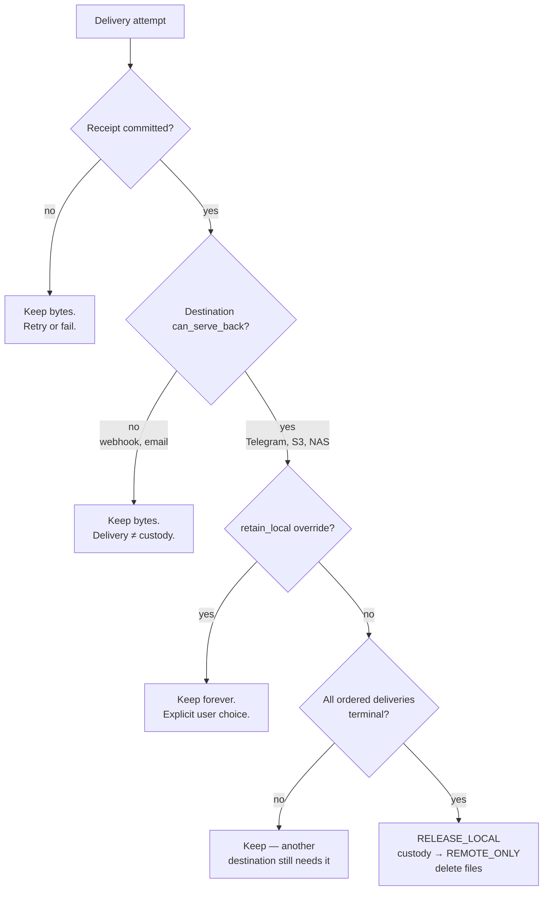
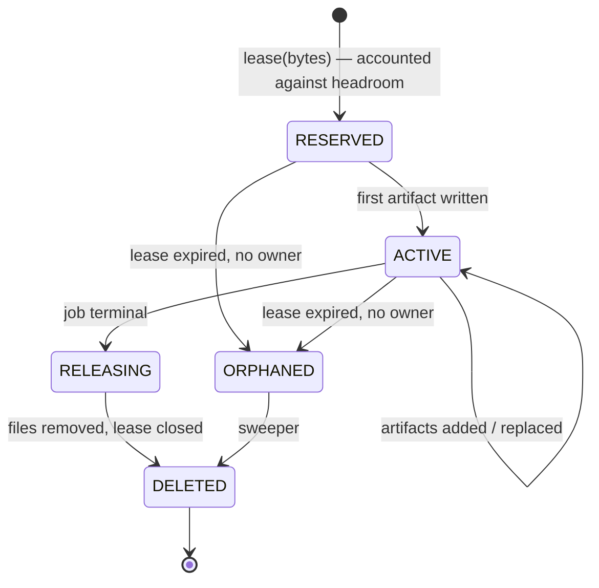

# 11. Storage Strategy

> **The rule that defines this document.**
> After successful delivery, local media is deleted automatically. MediaHub
> keeps metadata, history, remote reference (Telegram file id), message id,
> content hash and source URL. **Downloaded files are never kept permanently.**

Everything below exists to make that rule true even when the power fails at the
wrong moment.

---

## 11.1 Consequences of the rule

This is not a cleanup feature bolted onto a media library. It inverts the
model:

| Conventional media app | MediaHub |
| ---------------------- | -------- |
| Disk is the system of record | **The destination is the system of record** |
| Files are permanent, metadata describes them | **Metadata is permanent, files are transient** |
| Storage grows with usage | **Storage is bounded by concurrent work** |
| Backup = copy the files | **Backup = copy one small database** |
| Deletion is a user action | **Deletion is the normal end of every job** |

Design consequences:

1. There is **no library directory**. Naming one would legitimise permanent
   files. Phase 01's `library_path` setting and `MediaItem.storage_key` are
   therefore wrong ([20](20-architecture-decision-review.md) §4.6).
2. Disk requirement is `max_concurrent_jobs × max_item_size × ~2.2`, **not**
   "everything ever downloaded". A 32 GB SD card is genuinely sufficient.
3. Local paths are **never** an identity. Identity is `(source, fingerprint)`;
   location is a `RemoteArtifactRef`.
4. Cleanup is not best-effort. It is a **state transition with an invariant**.

---

## 11.2 Storage zones

| Zone | Path (default) | Lifetime | Volume | Backed up |
| ---- | -------------- | -------- | ------ | --------- |
| **Database** | `/data/mediahub.db` | permanent | persistent | **yes, daily** |
| **Workspace** | `/workspace/<lease_id>/` | one job | separate, disposable | no |
| **Cache** | `/cache/` | bounded, evictable | disposable | no |
| **Logs** | `/logs/` | rotated | disposable | no |
| **Config** | `/config/` | permanent | read-only mount | yes |

Separate volumes are not cosmetic:

- The workspace can be a **different device** (USB SSD) from the database (SD),
  putting the write-heavy, throwaway load away from the card holding the only
  irreplaceable data.
- The workspace can be wiped entirely at boot without touching anything that
  matters — and it is, because anything in there after a restart is by
  definition an orphan.
- Filling the workspace cannot corrupt the database, which is what happens when
  both share a full filesystem.

**Workspace on tmpfs?** Tempting on an 8 GB Pi 5 (zero SD wear, fast), but a
250 MB download in RAM competes with FFmpeg. Supported as an option
(`workspace.backend=tmpfs`) with a hard size cap, **not** the default.

---

## 11.3 Custody — when deletion is authorised

Deletion is authorised by *proof*, never by optimism.



`can_serve_back` is the crucial distinction. Posting a file to a webhook is a
delivery; it is **not** custody transfer, because the bytes cannot be retrieved
again. Deleting after such a delivery would destroy the only copy. Encoding this
in `DeliveryCapabilities` means a future provider gets the rule for free.

**Commit order** (from [07](07-download-pipeline.md) §7.5), and why it cannot be
reordered:

```
1. receipt committed          ← remote custody proven and durable
2. custody = REMOTE_ONLY      ← intent recorded durably
3. files deleted              ← idempotent, retryable, sweepable
```

Crash after 1: sweeper completes 2–3.
Crash after 2: sweeper completes 3.
Crash after 3: nothing to do.
Any other order can lose both copies.

---

## 11.4 What is kept, forever

| Kept | Size | Why |
| ---- | ---- | --- |
| Asset id, title, kind | ~200 B | identity, display |
| Canonical source URL + provider | ~150 B | re-acquisition if the remote copy dies |
| Content fingerprint (sha256) | 64 B | duplicate detection across URLs |
| Technical profile | ~200 B | future planning without re-probing |
| Remote refs: provider, principal, **file id**, **file unique id**, **message id**, verified_at | ~300 B each | re-delivery with zero bytes |
| Delivery receipts | ~200 B each | audit, "did they get it?" |
| Job history: stages, timings, attempts, failures | ~1 KB | diagnosis, statistics |
| Annotations (AI, tags) | variable, opt-in | search |

**≈2 KB per asset.** Ten thousand acquisitions ≈ 20 MB. The product can remember
everything it has ever done, on a Raspberry Pi, forever — precisely because it
stores none of the bytes.

### The risk this creates, stated plainly

If the Telegram message is deleted, or the bot token is rotated, or the account
is banned, **the bytes are gone**. MediaHub keeps the source URL and can attempt
re-acquisition, but the source may itself be gone.

Mitigations offered, none of them free:

| Mitigation | Cost |
| ---------- | ---- |
| `retain_local` per asset / per subscription | disk |
| Second `can_serve_back` destination (NAS, S3) | another destination to maintain |
| `file_unique_id` stored alongside `file_id` | none — always do it |
| Source URL retained for re-acquisition | none — always do it |
| Periodic remote-ref verification job | API calls, rate limit budget |

This is a deliberate product trade-off, not an oversight. It is listed in
[01](01-product-architecture.md) §1.9 as a top-level risk so that nobody
discovers it after losing something.

---

## 11.5 Workspace lifecycle



Rules:

- One lease per job. One directory per lease, named by lease id. **No shared
  scratch directory** — shared scratch makes ownership ambiguous, and ambiguous
  ownership means nobody deletes.
- Reservations are **accounted**, so two workers cannot both believe the last
  gigabyte is available. Reserve-then-use, never use-then-hope.
- Artifacts are referenced by opaque `ArtifactHandle`. Only the Workspace
  adapter resolves a handle to a path, which is what makes containment
  enforceable in one place ([14](14-security-architecture.md) §14.4).
- The workspace root is wiped at startup: anything present is, by construction,
  from a process that no longer exists.

---

## 11.6 Cleanup and the sweeper

Cleanup happens on the happy path **and** is guaranteed by a sweeper. Both are
required: the happy path is fast, the sweeper is correct.

| Sweep | Period | Action |
| ----- | ------ | ------ |
| Expired leases | 10 min | Lease expired and no live owner → delete directory |
| Orphan directories | 10 min | Directory on disk with no lease row → delete |
| Orphan leases | 10 min | Lease row with no directory → close row |
| Terminal jobs | 10 min | Job terminal but lease open → release |
| Stuck custody | 1 h | `LOCAL_AND_REMOTE` older than `max_local_retention` → force release |
| Cache eviction | 1 h | Cache over budget → LRU evict |
| Log rotation | continuous | Size + age caps |

Properties:

- **Idempotent** — running twice is harmless.
- **Bounded** — each pass deletes at most N directories, so a large backlog does
  not monopolise the disk or the CPU.
- **Observable** — every deletion is logged with bytes reclaimed and the reason;
  `storage_orphans_deleted_total` rising steadily means a leak elsewhere.
- **Conservative** — a directory is only deleted if it is older than one lease
  period *and* has no live owner. Never delete something a running job might be
  writing to.

---

## 11.7 Disk safety

Running out of disk on a Pi does not produce a clean error. It produces database
corruption, truncated writes and a device that will not boot. The architecture
treats free space as a **first-class admission input**, not an exception path.

```
free_headroom = free_bytes − reserved_bytes − emergency_reserve
```

| Threshold | State | Behaviour |
| --------- | ----- | --------- |
| headroom > 25% | `HEALTHY` | normal |
| 10–25% | `TIGHT` | refuse jobs larger than headroom/4; warn |
| 5–10% | `LOW` | refuse all new acquisitions; deliveries continue (they free space); alert |
| < 5% | `CRITICAL` | refuse everything; force-release stuck custody; page |

`emergency_reserve` (default 1 GB) is never allocatable. It exists so that when
everything else goes wrong, SQLite can still commit the transaction that records
what went wrong.

Additional protections: `max_item_bytes` (default 2 GB), per-principal storage
quota, byte ceiling enforced during streaming, and a filesystem-level quota on
the workspace mount where available.

---

## 11.8 Duplicate detection

Three layers, cheapest first:

| Layer | Key | When | Cost | Catches |
| ----- | --- | ---- | ---- | ------- |
| 1 | canonical source URL | pre-probe | ~0 | same link resubmitted |
| 2 | `(provider, provider_item_id)` | post-probe | ~0 | same video via different URL forms |
| 3 | content fingerprint (sha256) | post-download | one streamed pass | identical bytes from different sources |

Layers 1–2 avoid the download entirely — the valuable ones. Layer 3 cannot, but
still saves processing, upload, and the destination's storage by reusing the
existing remote ref.

**Fingerprint is computed streaming during the download**, not by re-reading the
file afterwards. Re-reading a 2 GB file on an SD card costs ~60 s of pure I/O for
information that was in memory moments earlier.

Perceptual/fuzzy matching (same content, different encode) is explicitly **out of
scope**: expensive, probabilistic, and wrong answers here mean a user does not
receive the file they asked for.

---

## 11.9 Retention

| Data | Retention | Configurable | Rationale |
| ---- | --------- | ------------ | --------- |
| Media bytes | until delivered | no | the product rule |
| Asset metadata | forever | no | tiny, and it is the product |
| Job history | forever (details pruned at 1 y) | yes | statistics stay, verbose payloads go |
| Dead letters | 90 days | yes | actionable window |
| Audit log | 1 year | yes | security posture |
| Probe cache | 24 h | yes | metadata goes stale |
| Logs | 7 days / 100 MB | yes | SD card survival |
| Progress checkpoints | with the job | no | — |
| Annotations | forever | yes | expensive to recompute |

"Prune details, keep facts" is the general rule: a two-year-old job keeps its
outcome, timings and asset link, and loses its verbose failure payloads.

---

## 11.10 Future storage providers

Both fit **without changing the core**, because they are `DeliveryTarget`s with
`can_serve_back=true`, not a second library.

### NAS / SMB / NFS

```
provider: nas
address:  { host, share, path_template }
capabilities: max_bytes=∞, allowed_containers=*, can_serve_back=true,
              supports_ref_reuse=true (path is the ref)
```

Use case: archival destination alongside Telegram. Once a NAS receipt exists,
custody transfer is satisfied by *either* destination — and the Telegram-only
risk (§11.4) disappears for anyone who wants to pay for it with a NAS.

### S3 / MinIO / B2

```
provider: s3
address:  { endpoint, bucket, key_template, storage_class }
capabilities: max_bytes=5 TB (multipart), can_serve_back=true,
              supports_presigned_urls=true
```

Adds one genuinely new capability — **presigned URLs** — which enables "deliver a
link instead of a file" for items too large for Telegram. That is a delivery
strategy, not a storage change, and it slots into `DeliveryCapabilities`
untouched.

**What must not happen:** neither provider may become a "local library with a
different path". If a future feature wants files kept on the Pi, that is
`retain_local=true` with all its costs made explicit — not a quiet return to
permanent storage.

---

## 11.11 Backup and restore

Only one thing needs backing up, and it is small.

| Item | Method | Frequency |
| ---- | ------ | --------- |
| `mediahub.db` | SQLite online backup API (**never** `cp` a live WAL database) | daily + before migrations |
| Config / `.env` | manual, off-device | on change |
| Workspace | **never** | — |

- Backups are written to a **different volume** and copied off-device. A backup
  on the same SD card protects against nothing that actually happens.
- Retention: 7 daily, 4 weekly.
- **Restore is drilled, not assumed.** A quarterly test restores the newest
  backup into a scratch container and asserts the asset count, the newest job,
  and that a known remote ref still resolves. An untested backup is a belief,
  not a control ([17](17-testing-strategy.md) §17.7).
- WAL checkpoint before backup; `PRAGMA integrity_check` after restore.

Because assets are ~2 KB each, a full backup of a year's use is a few tens of
megabytes — small enough to email to yourself, which is exactly the property a
self-hosted product should have.
