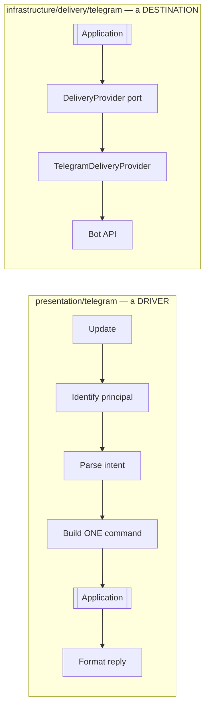

# 12. Telegram Architecture

> **Telegram is not the product. Telegram is a driver on one side and a
> destination on the other.** Deleting every Telegram file must break Telegram
> and nothing else. That is a testable claim, and it is tested.

---

## 12.1 Two adapters, not one integration

The single most common failure in bot-shaped products is one module that
receives updates, applies business rules, touches the database and sends
replies. It works for three months and then cannot be reused, tested or
replaced.

MediaHub splits Telegram into two adapters that share only an HTTP client:



| | Inbound gateway | Outbound provider |
| --- | --- | --- |
| Layer | `presentation/telegram/` | `infrastructure/delivery/telegram/` |
| Role | Translates messages into commands | Implements `DeliveryProvider` |
| Knows about | Application commands, Access | The Delivery port contract only |
| Must not | Touch repositories, decide policy, hold rules | Know why it is sending, or what a job is |
| Replaceable by | Web UI, CLI, mobile app | S3, NAS, email, webhook |

They do not import each other. A change to how uploads work cannot break how
commands are parsed.

---

## 12.2 Inbound gateway

**Responsibility.** Update → principal → intent → *exactly one* command →
formatted reply. Nothing else.

```
1. receive update            (long-poll by default; webhook optional)
2. deduplicate by update_id  (Telegram redelivers; this is normal)
3. resolve principal         Access: telegram user id → PrincipalId
4. authorise                 unknown user → single refusal, audited, no detail
5. rate limit                per principal, token bucket
6. parse intent              text / command / callback / forwarded message
7. build command             with idempotency_key = f"tg:{update_id}"
8. invoke application        one call
9. format reply              translate DTO or error code into human text
```

Rules with teeth:

- **One update, one command.** If a message would trigger two operations, that
  is a new use case, defined in the application layer where every interface can
  reach it — not a loop in a handler.
- **No repository access.** Grep for `Repository` under `presentation/telegram/`
  must return nothing.
- **No policy.** "Is this user allowed?" is Access. "Is this URL allowed?" is
  the domain. The gateway asks; it does not decide.
- **Idempotency by `update_id`.** Telegram *will* redeliver after a network
  blip; without this, one message becomes two downloads.
- **Errors are translated, not leaked.** A stack trace in a chat is an
  information disclosure bug.

### Intent surface (initial)

| Intent | Command |
| ------ | ------- |
| URL in a message | `SubmitAcquisitionCommand` |
| `/status [id]` | `GetJobQuery` / `ListJobsQuery` |
| `/cancel <id>` | `CancelJobCommand` |
| `/resend <asset> [target]` | `OrderDeliveryCommand` (zero-byte path) |
| `/search <text>` | `SearchAssetsQuery` |
| `/quota` | `GetQuotaQuery` |
| callback button | the command encoded in `callback_data` |

`/resend` deserves note: it is the user-facing surface of the re-delivery flow
([07](07-download-pipeline.md) §7.4) and costs one API call and zero bytes. It
exists because delivery is a separate aggregate — a design decision paying off
as a feature.

---

## 12.3 Outbound provider

Implements the `DeliveryProvider` port ([06](06-domain-model.md) §6.5):

```
capabilities() -> DeliveryCapabilities
supports(target) -> bool
deliver(artifact_or_ref, target, options) -> DeliveryReceipt
verify(remote_ref) -> RefStatus          # is this ref still usable?
```

Responsibilities: choosing the right send method per media kind, honouring rate
limits, mapping errors into the shared taxonomy, and returning a receipt with a
`RemoteArtifactRef`.

**Error mapping** — this table is the adapter's real value:

| Telegram condition | Kind | Notes |
| ------------------ | ---- | ----- |
| `429` + `retry_after` | `TRANSIENT` | `available_at = now + retry_after` exactly |
| `5xx`, timeout, connection reset | `TRANSIENT` | normal backoff |
| `413` / file too big | `PERMANENT` | `undeliverable_size` — re-plan or fail |
| `400` bad request (malformed) | `PERMANENT` | bug or bad input; do not retry |
| `403` blocked by user / kicked | `PERMANENT` | disable the target, notify owner |
| `401` unauthorized | `PERMANENT` + **alert** | token invalid — every stored ref is now suspect |
| chat not found | `PERMANENT` | target invalid |

`401` is special: it means every `file_id` for that bot is dead (§12.5). It
must alert, not silently retry.

---

## 12.4 Size limits — the constraint that shapes the pipeline

The Bot API's upload ceiling (**50 MB** for most file sends) is far below what
media acquisition produces. This is not a detail; it dictates the Processing
context's existence.

Strategy, in preference order:

| Strategy | When | Cost |
| -------- | ---- | ---- |
| **Send as-is** | under the ceiling | none |
| **Remux** | container overhead only | seconds |
| **Split** into parts | large but acceptable quality | I/O only — **preferred over transcoding on a Pi** |
| **Transcode** down | quality can be traded | minutes to hours — the expensive path |
| **Local Bot API server** | operator opted in | a service to run; ceiling rises to ~2 GB |
| **Deliver a link** | an S3/NAS destination exists | needs a second destination |
| **Refuse at admission** | none of the above fit | fastest possible failure |

The ceiling reaches the planner as `DeliveryCapabilities.max_bytes`, a number.
The planner never learns the word "Telegram" — which is exactly why a NAS
destination with `max_bytes=∞` needs no planner change.

**Local Bot API server.** Supported as configuration
(`telegram.api_base_url`), not assumed. It raises the ceiling to ~2 GB and
allows local-file uploads (no HTTP body copy — a real win on a Pi), at the cost
of another container and its own disk. The capability is *discovered from
configuration and reported through `capabilities()`*, so the planner adapts
automatically.

---

## 12.5 The `file_id` problem

Telegram identifiers have properties that the domain must respect but must not
name:

| Identifier | Scope | Stability | Usable to fetch |
| ---------- | ----- | --------- | --------------- |
| `file_id` | **per bot** | changes over time | yes |
| `file_unique_id` | global | stable | **no** |
| `message_id` | per chat | stable | via forwarding |

Consequences designed for:

1. **`RemoteArtifactRef.principal` records which bot owns the ref.** Rotating
   the token invalidates every `file_id`; the system must be able to *know*
   that rather than discover it one failed send at a time.
2. **Both ids are stored.** `file_unique_id` survives rotation and lets a
   re-acquired file be recognised as the same content.
3. **`message_ref` is stored.** Where a `file_id` is dead, forwarding the
   original message can still work.
4. **`verify(remote_ref)`** exists on the port so a maintenance job can validate
   refs and mark dead ones, moving custody to `LOST` deliberately instead of
   silently.
5. **Token rotation is a documented operational procedure**, not an incident:
   refs for the old principal are marked unverified; assets fall back to source
   re-acquisition when needed.

None of the words `file_id`, `chat_id` or `message_id` appear outside
`infrastructure/delivery/telegram/` and `presentation/telegram/`. An
architecture test asserts it ([04](04-dependency-graph.md) §4.6).

---

## 12.6 Rate limits

Telegram's practical limits — roughly 30 messages/second globally, ~20/minute
per group — are **normal operating conditions**, not failures.

- A token-bucket limiter inside the adapter shapes outbound traffic *before*
  hitting the API.
- `retry_after` from a `429` is authoritative and propagates to the delivery
  job's `available_at`.
- Delivery lane concurrency is capped at 2 — more parallelism just produces more
  `429`s.
- Uploads are chunked with progress; a large upload on domestic broadband takes
  minutes and must remain cancellable.

---

## 12.7 Long-poll vs webhook

| | Long-poll (**default**) | Webhook |
| --- | --- | --- |
| Inbound ports | none | 443 exposed, TLS, public DNS |
| Works behind NAT | yes | needs tunnel/proxy |
| Latency | ~1 s | ~100 ms |
| Attack surface | outbound only | **a public endpoint on a home network** |
| Ops burden | none | certificates, renewals, reverse proxy |

Long-poll is the default because a self-hosted Pi should not require opening a
port in someone's home router. Webhook is supported behind a flag for operators
who already run a reverse proxy, with a mandatory secret token and source
verification.

---

## 12.8 Failure isolation

The gateway is a **separate process** ([01](01-product-architecture.md) §1.3):

| Failure | Effect |
| ------- | ------ |
| Telegram unreachable | Gateway retries; API and worker unaffected; deliveries queue with backoff |
| Gateway crashes | API and jobs continue; already-queued work completes |
| Bot token invalid | Inbound stops, deliveries fail `PERMANENT`, **alert**; acquisitions still run and queue their deliveries |
| Flood-wait storm | Delivery lane backs off; acquisition lane unaffected |

Nothing about MediaHub's core stops working because Telegram is having a bad
day — which is the whole point of the separation.

---

## 12.9 What is deliberately not built

| Not built | Why |
| --------- | --- |
| Conversational state machines / multi-step wizards | Requires per-user session state in the gateway; a form in the Web UI is better and cheaper |
| Inline mode | Latency budget (<3 s) conflicts with probing |
| Business logic in `callback_data` | It is a 64-byte user-controlled field; it may carry a command *name* and ids, never a decision |
| Telegram as a database (files as storage backend) | It is a destination that happens to retain bytes. Building on that as a storage API is a dependency on someone else's ToS |
| Second bot for admin | Roles in Access solve this without another token to secure |
