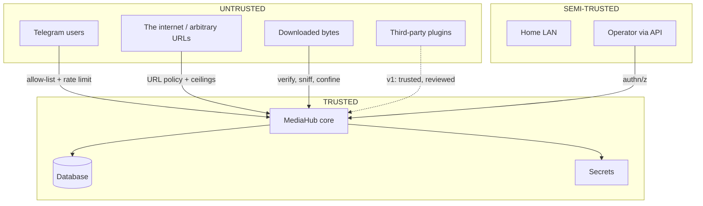

# 14. Security Architecture

MediaHub takes an **arbitrary URL from a user, fetches it over the network,
writes it to disk, executes third-party binaries against it, and uploads the
result**. That is close to a worked example of a dangerous system. The controls
below are not optional hardening; they are the reason it is safe to run at all.

---

## 14.1 Assets and trust boundaries

| Asset | Value | Exposure |
| ----- | ----- | -------- |
| Telegram bot token | Full control of the bot, access to every delivered file | Env, memory, outbound URLs |
| `security.secret_key` | Signing | Env, memory |
| The database | Every source URL, every remote ref, entire history | Disk, backups |
| The home network | Everything else on the LAN | **Reachable by the fetcher** |
| The device | Root on a machine inside a home | Subprocesses, container escape |
| Delivered media | Personal content | Destination account |



**Downloaded bytes are untrusted input**, not a payload. Filenames, metadata,
containers and archives inside them are all attacker-controlled.

---

## 14.2 Threat model (STRIDE, prioritised)

| # | Threat | Category | Likelihood | Impact | Control |
| - | ------ | -------- | ---------- | ------ | ------- |
| T1 | **SSRF** — URL resolves to LAN/localhost/cloud metadata | Info disclosure, EoP | **High** | **Critical** | §14.3 |
| T2 | **Path traversal / zip-slip** via provider-supplied filename | Tampering, EoP | High | High | §14.4 |
| T3 | **Command injection** into yt-dlp/FFmpeg arguments | EoP | Medium | **Critical** | §14.6 |
| T4 | **Resource exhaustion** — huge/infinite/live streams, decompression bombs | DoS | **High** | High | §14.5 |
| T5 | **Token theft** from logs, errors, backups | Info disclosure | Medium | **Critical** | §14.8 |
| T6 | **Unauthorised Telegram user** issuing commands | EoP | High | High | §14.7 |
| T7 | **Malicious media exploiting FFmpeg** (CVE) | EoP | Low | **Critical** | §14.6 |
| T8 | **Supply chain** — yt-dlp/FFmpeg/plugin compromise | EoP | Low | **Critical** | §14.9 |
| T9 | **Repudiation** — no record of who requested what | Repudiation | Medium | Medium | §14.10 |
| T10 | Public API exposure without auth | EoP | Medium | High | §14.7 |
| T11 | Database exfiltration via backup on shared storage | Info disclosure | Low | High | §11.11, §14.8 |
| T12 | Telegram delivery to the wrong chat | Info disclosure | Low | High | Target ownership check per delivery |

T1 is first because it is the one that turns a media tool into a pivot point
inside someone's home network, and it is trivially triggered by a single
pasted link.

---

## 14.3 URL policy — the SSRF gate

Applied at admission **and** re-applied inside the fetcher on every redirect.
Redirect-time re-validation is essential: an allowed host can `302` to
`169.254.169.254`.

```
1. length ≤ 2048
2. scheme ∈ {http, https}            — never file, ftp, gopher, data, dict
3. no embedded credentials (user:pass@)
4. no non-standard ports unless allow-listed
5. resolve DNS → for EVERY resolved address:
      reject loopback      127.0.0.0/8, ::1
      reject private       10/8, 172.16/12, 192.168/16, fc00::/7
      reject link-local    169.254/16, fe80::/10   (cloud metadata)
      reject multicast/reserved/unspecified
6. pin the validated address for the connection (defeats DNS rebinding)
7. re-run 1–6 on every redirect; cap redirects at 5
```

Notes:

- **Step 6 matters.** Validating a hostname and then letting the HTTP client
  re-resolve it is a TOCTOU hole — a rebinding attack answers the second lookup
  with `127.0.0.1`.
- `security.block_private_networks` defaults to **true** and may be disabled
  only with an explicit, logged, audited override for a user who genuinely wants
  to fetch from their own NAS.
- Violations are `POLICY` failures: terminal, audited, never retried.
- `UrlPolicy` lives in the domain ([06](06-domain-model.md) §6.7) so it applies
  identically to HTTP, Telegram, CLI and automation. A control that exists in
  only one interface is not a control.

---

## 14.4 Filesystem safety

Every path is derived, never accepted:

| Rule | Prevents |
| ---- | -------- |
| Artifacts are addressed by opaque `ArtifactHandle`; only the Workspace adapter resolves paths | Path handling scattered across the codebase |
| Filenames are **generated** (`<artifact_id>.<validated-ext>`), not taken from the provider | Traversal, control characters, unicode confusables, reserved Windows names |
| Original filename stored as **metadata only**, never as a path component | The same, one layer deeper |
| `realpath(target).is_relative_to(realpath(lease_root))` asserted before every write | Traversal, symlink escape |
| Symlinks are never followed on write; `O_NOFOLLOW` where available | Symlink attacks |
| Archive extraction (if ever added) validates each entry against the same rule | Zip-slip |
| Extension allow-list, cross-checked against sniffed content type | Executable payloads, mismatched content |
| Workspace mounted `noexec,nosuid,nodev` | Executing downloaded content |

The strongest control here is the first: because nothing outside the Workspace
adapter can turn a handle into a path, there is exactly **one** function to
audit.

---

## 14.5 Resource exhaustion

| Vector | Control |
| ------ | ------- |
| Huge file | `max_item_bytes` enforced **while streaming**; `Content-Length` is a hint from an attacker |
| Infinite / live stream | Probe detects live; refused unless enabled; absolute wall-clock cap |
| Slow-loris source | Stall timeout (no bytes for N seconds) |
| Decompression bomb | Ratio and absolute output caps on any extraction/transcode |
| Many small requests | Per-principal rate limit + `max_concurrent` |
| Disk exhaustion | Reservation accounting + admission thresholds ([11](11-storage-strategy.md) §11.7) |
| CPU exhaustion | Global processing semaphore, `max_cpu_seconds` per plan, container CPU quota |
| Memory exhaustion | Streaming everywhere (never `read()` a whole file), container memory limit |
| Fork bomb via subprocess | Process-group kill, `pids_limit` on the container |

**Every limit is enforced during the operation, not validated before it.**
Pre-validation trusts the attacker's declaration.

---

## 14.6 Subprocess confinement

yt-dlp and FFmpeg are large C/Python surfaces processing hostile input.

| Control | Detail |
| ------- | ------- |
| No shell | `create_subprocess_exec` with an argv list. Never `shell=True`, never string interpolation |
| Argument separation | `--` before positional arguments; a filename beginning with `-` must never become a flag |
| No user-controlled flags | Users supply URLs and quality preferences from a **closed enum**, never raw options |
| Timeouts | Hard wall-clock cap; kill the **process group**, not just the parent |
| Working directory | The job's lease directory only |
| Environment | Minimal, explicit allow-list. **The bot token is never in a subprocess environment** |
| User | Non-root (`uid 1001`), no new privileges |
| Filesystem | Read-only root; only the lease directory writable; `noexec` |
| Network (FFmpeg) | `-protocol_whitelist file,pipe` — FFmpeg speaks HTTP and is an SSRF vector of its own |
| Output parsing | Treated as untrusted input; bounded reads; no `eval` of JSON-ish output |

The FFmpeg protocol whitelist is the subtle one: a crafted playlist can make
FFmpeg fetch arbitrary URLs, bypassing every URL check performed at admission.

---

## 14.7 Authentication and authorisation

| Interface | AuthN | AuthZ |
| --------- | ----- | ----- |
| Telegram | Telegram user id, **allow-list** | Role + quota via Access |
| HTTP API | API key (hashed at rest) or local-only bind | Role + resource ownership |
| CLI | Local process, `OWNER` | Full |
| Web UI (future) | Session cookie, CSRF | Role |

Rules:

- **Deny by default.** An unknown Telegram user gets one refusal and an audit
  entry — no hint about what the bot is or does.
- Authorisation is a **domain policy** (`AuthorizationPolicy`), not middleware,
  so every interface enforces the same rules. Middleware-only authorisation
  means the CLI and the worker quietly bypass it.
- **Resource ownership is checked per operation**: a member may not cancel
  another principal's job, and — critically — may not deliver an asset to a
  target they do not own (T12).
- The API binds to `127.0.0.1` by default. Exposing it requires an explicit
  setting, and the configuration validator refuses `0.0.0.0` + no API key in
  production.
- Rate limits are per principal **and** per action, applied before expensive
  work ([07](07-download-pipeline.md) §7.2).

---

## 14.8 Secrets

Covered in [13](13-configuration-architecture.md) §13.5. The security-critical
additions:

- **Redacting log sink is mandatory.** The single most likely token leak is a
  third-party library logging `https://api.telegram.org/bot<TOKEN>/sendDocument`.
  Typed `SecretStr` does not help there; a pattern-matching sink does.
- **Never log full URLs at INFO.** Query strings routinely carry signed tokens
  from CDNs. Log the host and a hash of the path.
- Secrets are never persisted in the database, never included in problem
  documents, never used as metric labels, never in job payloads.
- Backups contain source URLs and remote refs — treat them as sensitive: encrypt
  at rest if stored off-device.

---

## 14.9 Supply chain

The uncomfortable truth: **yt-dlp must be updated often to keep working, and
updating it means pulling new executable code from the internet.**

| Control | Decision |
| ------- | -------- |
| Runtime self-update (`yt-dlp -U`) | **Forbidden.** It would let a compromised release execute on the device with no review, and it makes the running system unreproducible |
| Version pinning | All Python dependencies pinned with hashes |
| Update cadence | Scheduled image rebuild (weekly) with a changelog review; the deployment unit is an image, not a mutating container |
| Provenance | Multi-arch images built in CI, digest-pinned base images |
| Vulnerability scanning | Dependency and image scan in CI; fail on critical |
| FFmpeg | From the distribution, patched via base image rebuilds |
| Plugins | v1: first-party only, reviewed, in-tree ([15](15-plugin-architecture.md) §15.7) |
| SBOM | Generated per build, retained |

This is a real trade-off: pinning means a site breaks and stays broken until the
next rebuild. That is the correct direction to fail — a broken extractor is an
inconvenience; an auto-updated backdoor is a compromised home network.

---

## 14.10 Audit logging

An append-only record, separate from operational logs, answering "who did what".

| Logged | Fields |
| ------ | ------ |
| Authentication success/failure | principal or external id, interface, outcome |
| Authorisation denial | principal, action, resource, reason |
| Acquisition submitted | principal, canonical URL, job id |
| URL policy violation | principal, raw URL (truncated), rule that fired |
| Delivery performed | principal, asset, target, receipt |
| Configuration/target/quota change | principal, before → after |
| Data erasure | principal, asset, scope |
| Quota exceeded | principal, quota, window |

Properties: append-only (no update/delete path in the repository), retained one
year, contains no secrets and no media content, exportable, and carries the
`correlation_id` that ties it to operational logs.

---

## 14.11 Container security

| Control | Setting |
| ------- | ------- |
| Non-root | `USER 1001` (already in Phase 01) |
| Read-only root filesystem | `read_only: true` + explicit tmpfs |
| Capabilities | `cap_drop: [ALL]` |
| Privilege escalation | `no-new-privileges:true` |
| Resource limits | cpus, memory, `pids_limit` per role |
| Workspace mount | `noexec,nosuid,nodev` |
| Network | API on the internal network only unless exposed deliberately |
| Secrets | Docker secrets (files), not env, where available |
| Image | Multi-stage, no build toolchain in runtime (already), digest-pinned base |
| Healthcheck | Present per role |

The worker is the container most likely to be exploited (it runs the parsers),
so it gets the tightest limits and the fewest capabilities — and it holds **no
inbound network path**.

---

## 14.12 Privacy

This is someone's personal media on hardware in their home.

- **No telemetry.** No phone-home, no analytics, no crash reporting to a third
  party. Metrics stay on the device.
- **Remote AI is opt-in per provider and per data class**, with an audit entry
  per call. The default is that nothing leaves the device
  ([03](03-subsystems.md) §3.17).
- **Erasure is real**: "forget this asset" deletes metadata, history and
  annotations, and records the erasure in the audit log. It cannot delete the
  copy held by the destination — the UI must say so plainly rather than imply
  otherwise.
- Logs contain URLs and titles; log retention is short by default (7 days) and
  logs are excluded from backups.

---

## 14.13 Security testing obligations

Not aspirational — these are required tests
([17](17-testing-strategy.md) §17.8):

| Test | Asserts |
| ---- | ------- |
| SSRF corpus | localhost, 127.x, 10.x, 192.168.x, 169.254.169.254, IPv6 forms, decimal/octal IPs, rebinding, redirect-to-private are **all** refused |
| Traversal corpus | `../`, encoded, unicode, absolute, symlink, null-byte filenames are contained |
| Argument injection | Filenames/URLs starting with `-`, containing `;`, `$()`, newlines reach the subprocess as literal argv |
| Secret redaction | A token in a URL, an exception message and a third-party log line never appears in output |
| Authorisation | Every mutating endpoint rejects a non-owner principal |
| Size ceiling | A stream that lies about `Content-Length` is aborted at the ceiling |
| Rate limit | Burst beyond budget is refused, and refusal is cheap |

A regression in any of these is a release blocker.
