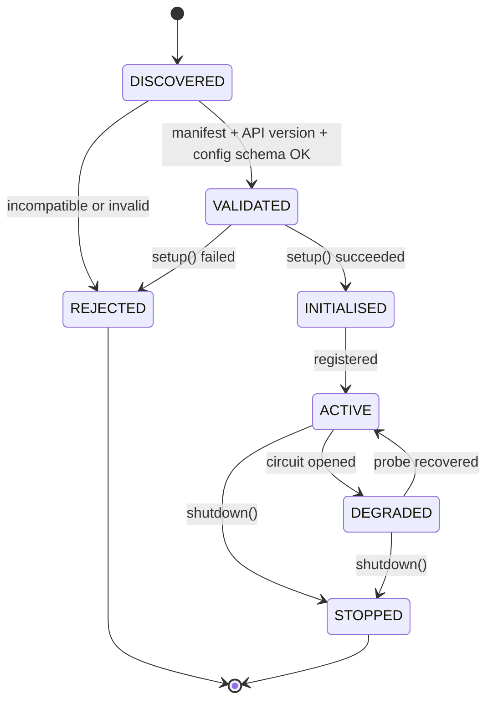

# 15. Plugin Architecture

Extensibility is the reason this system has ports at all. But a plugin system is
itself a subsystem — with discovery, versioning, lifecycle, failure isolation
and a security model — and building it before there is anything to plug in is
the classic way to produce an elaborate framework with one implementation.

**Decision: define the contracts now, ship first-party plugins in-tree, defer
third-party loading.** Reasoning and the migration path are below and in
[ADR-0011](../adr/0011-trusted-in-process-plugins.md).

---

## 15.1 Extension points

Every extension point is an existing port. That is deliberate: a plugin is not a
special kind of component, it is **the second implementation of something the
architecture already needed**.

| Point | Port | Examples | Priority |
| ----- | ---- | -------- | -------- |
| Downloader | `DownloaderPort` | yt-dlp, plain HTTP, torrent, local import | P1 |
| Media processor | `MediaProcessorPort` | FFmpeg, ImageMagick, PDF tools | P1 |
| Delivery provider | `DeliveryProvider` | Telegram, S3, NAS, webhook, email | P1 |
| Source resolver | `SourceResolverPort` | provider-specific canonicalisation/probing | P2 |
| Notification provider | `DeliveryProvider` (payload kind = notice) | ntfy, Gotify, email | P2 |
| AI provider | `AiProviderPort` | whisper.cpp, ollama, remote APIs | P3 |
| Metadata enricher | `EnricherPort` | TMDB, MusicBrainz | P3 |
| Storage provider | `DeliveryProvider` with `can_serve_back` | S3, NAS | P3 |

Note what is **not** an extension point: the domain, the state machines, the
admission policy, the queue. Those are the system. A plugin that needs to change
a state transition is asking for a fork, and pretending otherwise produces a
codebase where no invariant can be trusted.

---

## 15.2 Contract shape

Every plugin contract has the same four parts. Uniformity is the feature — it
makes a new extension point a 30-minute job instead of a design exercise.

| Part | Purpose |
| ---- | ------- |
| `manifest` | Identity: name, version, API version, capabilities, config schema |
| `capabilities()` | What it can do *right now*, given its configuration |
| `supports(subject)` | Cheap, pure predicate for selection |
| operation(s) | The actual work, with progress and cancellation |

Sketch (specification, not code):

```
class DownloaderPlugin(Protocol):
    manifest: PluginManifest
    def capabilities(self) -> DownloadCapabilities: ...
    def supports(self, source: SourceDescriptor) -> bool: ...
    async def probe(self, source, *, timeout) -> ProbeResult: ...
    async def fetch(self, request, *, progress, cancel) -> FetchOutcome: ...
    async def health(self) -> HealthStatus: ...
```

Rules:

1. **Primitives and plugin DTOs only.** No domain types cross the boundary. A
   plugin that imports `MediaAsset` is coupled to the core's internals and
   blocks every refactor.
2. **The SDK is a standalone package** (`mediahub.plugins.api`) importing
   nothing from the layers ([04](04-dependency-graph.md) §4.1). It is what a
   third party would depend on.
3. **Async and cancellable.** Every long operation accepts a cancellation token
   and honours it.
4. **Errors are classified by the plugin**, into the shared taxonomy
   (`TRANSIENT`/`PERMANENT`/`POLICY`). Only the plugin can interpret its
   provider's errors ([03](03-subsystems.md) §3.2).
5. **Stateless between calls.** Any state lives in the core's persistence.
   A plugin holding state cannot be restarted, scaled, or reasoned about.

---

## 15.3 Selection

Multiple plugins may support one subject. Selection is explicit and predictable:

```
candidates = [p for p in registry.of(kind) if p.enabled and p.supports(subject)]
ordered    = sort by (config priority DESC, specificity DESC, name ASC)
chosen     = first candidate whose health is not "circuit open"
```

- **Specificity beats generality**: a provider-specific downloader outranks the
  generic HTTP one.
- **Configuration beats both**: an operator can pin an order.
- **Deterministic ties**: alphabetical. Non-deterministic selection produces
  bugs that reproduce only on some machines.
- **Fallback is opt-in per kind.** Falling back after a *download* failure is
  usually wrong (the first attempt already consumed time and bandwidth);
  falling back after a *probe* failure is usually right.

---

## 15.4 Lifecycle



- Discovery and validation happen **at startup only**. No hot loading: a plugin
  appearing mid-run cannot be reasoned about, and the failure modes (partially
  initialised, mid-job swap) are ugly.
- A rejected plugin **does not stop the system**. It is logged loudly, reported
  by `/health`, and the system runs without it. One bad plugin must not brick a
  household's media tool.
- `shutdown()` is called on drain, with a timeout.

---

## 15.5 Versioning

Two independent versions, and conflating them is the standard mistake:

| Version | Meaning | Rule |
| ------- | ------- | ---- |
| `api_version` | Which SDK contract the plugin implements | Semver. Core accepts `>=1.0,<2.0` |
| `plugin.version` | The plugin's own release | Semver, informational |

Contract evolution:

- **Additive only within a major.** New optional methods get default
  implementations in the SDK's base class; new capability fields default to
  conservative values.
- **Never change a method's meaning silently.** Behaviour changes get a new
  method name.
- **Deprecation window of one minor**, with a startup warning naming the plugin.
- Breaking changes bump the major and the core supports both for one release.

This is the contract that must survive ten years. Internal refactors are free;
this is not.

---

## 15.6 Failure isolation

A plugin is the most likely thing to be broken, because it wraps the most likely
thing to change.

| Failure | Containment |
| ------- | ----------- |
| Raises | Caught at the invocation boundary; classified; job handled normally |
| Hangs | Mandatory timeout per operation; enforced by the caller, not trusted to the plugin |
| Leaks memory | Worker process restarts on RSS threshold; other roles unaffected |
| Consistently fails | **Circuit breaker per plugin**: N failures in a window → `DEGRADED`, skipped in selection, retried on a probe schedule |
| Misbehaves on init | Rejected at startup, system continues |
| Writes outside its lease | Blocked by workspace containment ([14](14-security-architecture.md) §14.4) |

The circuit breaker is what keeps a dead extractor from consuming the entire
retry budget of every job for an hour.

---

## 15.7 Security posture — v1 is trusted

**Decision: v1 plugins run in-process with full privileges. There is no
sandbox, and therefore there is no third-party plugin marketplace.**

The honest reasoning:

- A Python plugin loaded in-process **is** the application. Import-time code
  executes with the worker's privileges; there is no meaningful boundary short
  of a separate process or a WASM/container runtime.
- Real isolation (subprocess with IPC, seccomp, or WASM) is a substantial
  subsystem — serialisation, lifecycle, streaming progress across a boundary,
  debugging — that would cost more than every plugin planned for the next year.
- Pretending otherwise is worse than not having plugins: an "extension system"
  that implies safety it does not provide invites users to install code that
  ships their bot token to a stranger.

Therefore, for v1:

| Rule | |
| ---- | - |
| Plugins are **first-party, in-tree, reviewed** | Same repository, same CI, same tests |
| No dynamic loading from disk or PyPI at runtime | Discovery is over a static registry |
| Third-party extension = fork or PR | Explicit, reviewed, honest |
| Plugin config is validated against the manifest schema | No arbitrary passthrough into subprocess arguments |
| Documented, prominently | The plugin API docs must state that a plugin has full device access |

**Migration to untrusted plugins**, when there is demand:

1. Move plugin execution into a subprocess with a typed IPC contract (the
   contracts in §15.2 are already process-boundary-friendly — primitives only,
   no shared objects — which is why this stays a change of transport, not of
   design).
2. Confine that process (user, seccomp, namespaces, no network by default).
3. Add a manifest permission model (`network`, `filesystem`, `subprocess`) with
   explicit grants.
4. Only then consider signing and distribution.

The design deliberately keeps step 1 cheap. That is what "designed for the
future" means here — not building the sandbox, but making sure the contract does
not prevent it.

---

## 15.8 Configuration

```
MEDIAHUB_PLUGINS__<PLUGIN_NAME>__ENABLED=true
MEDIAHUB_PLUGINS__<PLUGIN_NAME>__PRIORITY=100
MEDIAHUB_PLUGINS__<PLUGIN_NAME>__<SETTING>=...
```

Each plugin declares a config schema in its manifest; the core validates against
it at startup and refuses to initialise a misconfigured plugin
([13](13-configuration-architecture.md) §13.6). Secrets follow the `_FILE`
convention. A plugin never reads `os.environ` itself — it receives a validated,
scoped settings object.

---

## 15.9 Testing obligations

Every plugin must pass the **shared contract test suite** for its kind, provided
by the SDK. This is the mechanism that keeps N implementations honest without N
sets of bespoke tests.

| Contract test asserts | Why |
| --------------------- | --- |
| `supports()` is pure, fast (<1 ms), side-effect free | It is called in selection loops |
| Cancellation is honoured within 1 s | Otherwise cancellation is a lie |
| Timeouts are respected | A hung plugin holds a worker slot forever |
| Errors are classified, never raw exceptions | Retry logic depends on it |
| Progress is monotonic and bounded | UIs and metrics depend on it |
| No writes outside the provided workspace | Containment |
| `capabilities()` matches actual behaviour | The planner trusts it |
| Idempotent re-invocation after a crash | Lease reclaim requires it |

A plugin that cannot pass these is not integrated. See
[17](17-testing-strategy.md) §17.4.

---

## 15.10 Worked example — adding an S3 storage destination

To show that the architecture actually delivers on the promise:

| Step | Files touched |
| ---- | ------------- |
| 1. Implement `DeliveryProvider` for S3 | `infrastructure/delivery/s3/` (new) |
| 2. Declare capabilities: `max_bytes=5 TB`, `can_serve_back=true`, presigned URLs | same |
| 3. Register in the plugin registry | `infrastructure/plugins/registry.py` (one line) |
| 4. Add config section | `shared/config/settings.py` (one section) |
| 5. Pass the delivery contract test suite | `tests/contract/` (parametrised — no new test file) |

**Not touched:** `domain/`, `application/`, the Telegram provider, the pipeline,
the state machines, the API.

The custody rules then work for S3 automatically, because `can_serve_back=true`
is what authorises local deletion ([11](11-storage-strategy.md) §11.3) — the
new destination inherits a rule nobody had to re-implement. That is the payoff
of putting the concept in the domain instead of in the Telegram adapter.
