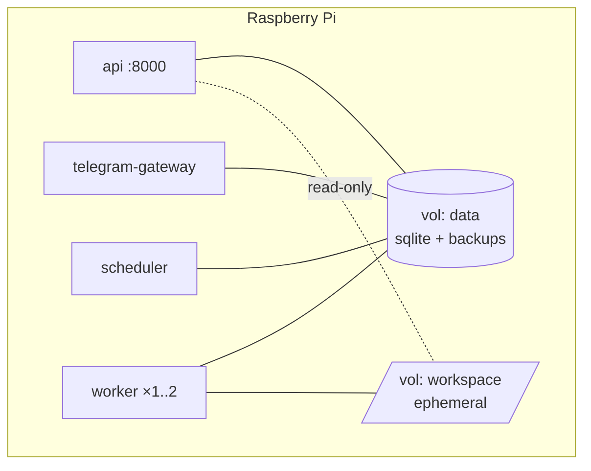

# 18. Deployment Architecture

Target: **one Raspberry Pi, in a home, operated by its owner, with no on-call
rota and occasional power cuts.** Every decision below optimises for "recovers
by itself" over "scales".

---

## 18.1 Deployment unit

**One image, several roles.** The role is chosen by the container command.

```
mediahub:<version>-<arch>
  ├── api                 uvicorn, HTTP + SSE
  ├── worker              claim loop
  ├── telegram-gateway    long-poll / webhook
  └── scheduler           timers and sweeps
```

Why one image:

- One dependency set, one build, one version — no "works in the API, missing in
  the worker" class of bug.
- Rollback is one tag for the whole system.
- The Pi pulls one image, not four. On domestic broadband and an SD card, that
  is minutes rather than tens of minutes.

Cost: the API image carries FFmpeg and yt-dlp it never uses (~150 MB). Accepted
deliberately — the alternative is version skew between roles, which is a
correctness problem, not a size problem.

---

## 18.2 Image

Multi-stage, extending Phase 01's structure (which is already correct: builder +
runtime, non-root, no build toolchain in the runtime layer).

| Stage | Contents |
| ----- | -------- |
| `builder` | Build deps, virtualenv, wheels compiled for ARM64 |
| `runtime` | Python slim, FFmpeg, virtualenv, non-root user, entrypoint |

Requirements:

- **Multi-arch** (`linux/arm64` primary, `linux/amd64` for CI and dev), built
  with buildx. Building on the Pi itself is possible and slow; CI cross-builds.
- **Digest-pinned base image**, rebuilt weekly for CVEs
  ([14](14-security-architecture.md) §14.9).
- FFmpeg from the distribution, not a static download — it gets security
  updates through base image rebuilds.
- yt-dlp **pinned**, updated by rebuild, never self-updating at runtime.
- Healthcheck per role (HTTP for `api`, heartbeat-file for the others).
- Image labels: version, commit, build date, SBOM digest.

---

## 18.3 Compose topology



| Service | Restart | CPU | Memory | Notes |
| ------- | ------- | --- | ------ | ----- |
| `api` | unless-stopped | 1.0 | 256 M | Binds `127.0.0.1` by default |
| `telegram-gateway` | unless-stopped | 0.5 | 192 M | No inbound ports in long-poll mode |
| `worker` | unless-stopped | 3.0 | 1 G | `stop_grace_period: 45s` |
| `scheduler` | unless-stopped | 0.5 | 128 M | Exactly one instance |

Critical settings that are easy to get wrong:

- **`stop_grace_period` (45 s) must exceed the worker's `drain_grace` (30 s).**
  If it does not, graceful shutdown never completes and every deploy causes
  lease reclaims ([10](10-worker-architecture.md) §10.7).
- **Log rotation on every service** (`max-size: 10m, max-file: 3`). Docker's
  default is unbounded, and an unbounded log on an SD card is a scheduled
  outage.
- **`read_only: true`** with explicit tmpfs for `/tmp`, plus `cap_drop: [ALL]`
  and `no-new-privileges` ([14](14-security-architecture.md) §14.11).
- **Workspace volume mounted `noexec,nosuid,nodev`**, ideally on a different
  physical device from `data`.
- `depends_on` cannot express "migrations are done" — see §18.4.

Phase 01's Compose file needs three corrections: **remove Redis**
(§[09](09-queue-architecture.md) 9.1), **replace Postgres with a data volume**,
and **add the worker/scheduler/gateway services**.

---

## 18.4 Migrations and startup ordering

With SQLite there is no database server to wait for, but there *is* a single
file that four processes will open.

```
1. one process runs migrations  (a dedicated `migrate` one-shot service)
2. every other service waits for it to exit 0
3. api / worker / gateway / scheduler start
4. each verifies "schema version == expected" at boot, and refuses otherwise
```

Rules:

- **Exactly one migrator.** Four processes racing `alembic upgrade` on one
  SQLite file is a corruption scenario. Phase 01's entrypoint runs migrations in
  the API container — acceptable with one process, wrong with four.
- **Backup immediately before migrating** ([11](11-storage-strategy.md) §11.11).
  SQLite migrations that rebuild tables (batch mode) are not free to reverse.
- **Refuse to run against a newer schema than the code expects.** A rolled-back
  image against a migrated database is silent data corruption; a refusal to
  start is a five-minute fix.
- Migrations must be **backwards compatible for one version** (expand → migrate
  → contract), so a rollback does not require a restore.

---

## 18.5 Operations

| Task | Mechanism |
| ---- | --------- |
| Deploy | `docker compose pull && up -d` — drains gracefully, jobs resume |
| Rollback | Pin the previous tag; schema is backwards compatible by policy |
| Backup | Scheduler task, daily, SQLite online backup API, off-device copy |
| Restore | Documented procedure, **drilled quarterly** |
| Update yt-dlp | Weekly image rebuild |
| Logs | `docker compose logs -f <role>`; structured JSON in production |
| Diagnostics | `/health/deep`, `/metrics` |
| Emergency stop | `docker compose stop worker` — leases expire, jobs resume later |

**A deploy during an active download is safe**: the worker drains, checkpoints,
releases its lease, and the new worker resumes. This is the practical payoff of
the lease/checkpoint design and should be verified in the smoke suite
([17](17-testing-strategy.md) §17.9).

---

## 18.6 Kubernetes readiness

Not a target. But the architecture should not *prevent* it, and being honest
about the blockers is more useful than claiming readiness.

**Already compatible:**

| Property | Status |
| -------- | ------ |
| 12-factor configuration | ✅ env-driven, typed, validated |
| Stateless API process | ✅ |
| Health/readiness endpoints | ✅ separate semantics |
| Graceful shutdown on SIGTERM | ✅ designed |
| One image, multiple roles | ✅ maps to Deployments |
| Structured logs to stdout | ✅ |
| Prometheus endpoint | ✅ |
| Crash-safe work (leases) | ✅ maps to pod eviction |

**Blockers, in order:**

| # | Blocker | Change required |
| - | ------- | --------------- |
| 1 | **SQLite is node-local** | PostgreSQL: swap `infrastructure/persistence/`, claim becomes `FOR UPDATE SKIP LOCKED` (the port already specifies "atomic claim", not the mechanism) |
| 2 | **Workspace is node-local** | Either pin workers to a node (`ReadWriteOnce` PVC) or accept that a job is bound to its node — the latter is fine, since a job's artifacts are meaningless elsewhere |
| 3 | Scheduler singleton | A `Lease` object or a single-replica Deployment |
| 4 | Migration ordering | Init container / Job |

Blocker 1 is the only one requiring real work, and it is confined to one package
**because the queue was specified as a port rather than as raw SQL**. That is
the concrete value of the abstraction — not hypothetical portability, but a
scoped migration.

**Recommendation: do not do this** unless a genuine multi-node requirement
appears. A single Pi with an automatically-recovering queue is more reliable
than a three-node k3s cluster that one person maintains.

---

## 18.7 Capacity

| Resource | Design point | First bottleneck |
| -------- | ------------ | ---------------- |
| Concurrent acquisitions | 1–2 | Bandwidth, then CPU |
| Jobs per day | ~500 | Nothing structural |
| Catalogue size | 100 000 assets (~200 MB DB) | SQLite handles far more |
| Queue depth | 10 000 | Claim query stays indexed |
| Disk | 32 GB SD + optional SSD | `max_item × concurrency × 2.2` |
| RAM | 2 GB minimum, 4 GB comfortable | FFmpeg during transcode |

**What breaks first, in order:**

1. **Disk headroom**, if cleanup is broken — hence the custody metric
   ([16](16-monitoring.md) §16.4) is the top gauge.
2. **CPU**, if transcoding is common — hence "prefer split over transcode".
3. **SQLite write contention**, above ~50 writes/second — nowhere near the
   design point, and the reason progress writes are throttled.
4. **Bandwidth** — not solvable in software.

---

## 18.8 Disaster scenarios

| Scenario | Recovery | Data loss |
| -------- | -------- | --------- |
| Power cut mid-download | Automatic: lease reclaim, resume | Partial file (swept) |
| SD card corruption | Restore DB from off-device backup | Since last backup (≤24 h of metadata) |
| SD card dies entirely | New card, re-deploy, restore backup | As above |
| Database corruption | `integrity_check` on boot → restore | As above |
| Bot token compromised | Rotate; refs for the old principal marked unverified | Access to old `file_id`s |
| Telegram account lost | **Assets in `REMOTE_ONLY` are unrecoverable** except by re-acquisition from source | The media itself |
| Docker/host reinstall | Re-deploy, restore, workspace wiped (correctly) | None if the backup is current |

The second-to-last row is the honest cost of the delete-after-delivery rule. It
is mitigated but not eliminated by a second `can_serve_back` destination
([11](11-storage-strategy.md) §11.4), and it must be stated in user-facing
documentation, not just here.

---

## 18.9 Deployment checklist

Before a release is considered deployable:

- [ ] Multi-arch image builds and runs on ARM64
- [ ] Migrations apply from empty **and** from the previous release
- [ ] Migrations are reversible, or the irreversibility is documented
- [ ] All healthchecks green within 60 s of a cold start
- [ ] Graceful shutdown drains inside `stop_grace_period`
- [ ] Backup ran and a restore drill passed
- [ ] `/health/deep` reports every subsystem
- [ ] Log rotation configured on every service
- [ ] Secrets supplied as files, not env, where supported
- [ ] Resource limits set per role
- [ ] Smoke suite green against real Compose
